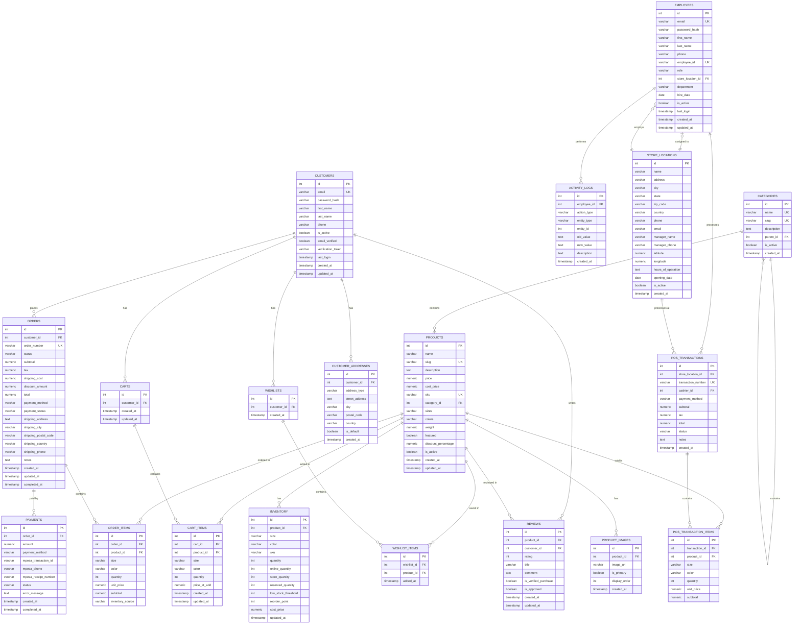

# Happy Place Boutique - Database Schema Documentation

**Version:** 2.2
**Date:** November 23, 2025
**Author:** Development Team
**Status:** DRAFT - Pending Review

**IMPORTANT UPDATES:**
- Users table has been separated into CUSTOMERS (online shoppers) and EMPLOYEES (system users: admin, managers, cashiers)
- **GDPR Compliance** added - See [DATABASE_SCHEMA_GDPR.md](DATABASE_SCHEMA_GDPR.md) for full details

---

## Table of Contents
1. [Overview](#overview)
2. [Architecture Decision: Customers vs Employees](#architecture-decision-customers-vs-employees)
3. [Entity Relationship Diagram](#entity-relationship-diagram)
4. [Table Definitions](#table-definitions)
5. [Relationships](#relationships)
6. [Indexes](#indexes)
7. [Migration Plan](#migration-plan)

---

## Overview

This document outlines the complete database schema for the Happy Place Boutique e-commerce platform, supporting both online shopping and physical store (POS) operations.

### Database Type
- **DBMS:** PostgreSQL 14+
- **Encoding:** UTF-8
- **Timezone:** UTC

### Key Features Supported
- Separate authentication for customers and employees
- Product catalog with categories and variants
- Unified inventory management (online + physical store)
- Shopping cart and wishlist
- Order management and checkout
- M-Pesa payment integration
- Multiple product images
- Product reviews and ratings
- Point of Sale (POS) for physical stores
- Store location management
- Activity logging for admin dashboard

---

## Architecture Decision: Customers vs Employees

### Why Separate Tables?

**CUSTOMERS Table (Online Shoppers):**
- Public-facing accounts
- Self-registration allowed
- Need shipping addresses
- Associated with orders, carts, wishlists, reviews
- Less strict authentication requirements
- Can be inactive but retain order history

**EMPLOYEES Table (System Users):**
- Internal staff accounts (Admin, Managers, Cashiers, Inventory Staff)
- Created only by administrators
- Need employee-specific data (employee_id, hire_date, department)
- Associated with POS transactions, activity logs
- Stricter authentication and security requirements
- Role-based access control for admin dashboard and POS
- Can be assigned to specific store locations

### Authentication Flow

- **Customers:** Login → Online Store (browse, shop, checkout)
- **Employees:** Login → Admin Dashboard / POS System (manage inventory, process sales)

---

## Entity Relationship Diagram



---

## Table Definitions

### 1. CUSTOMERS
**Purpose:** Store customer accounts for online shoppers with GDPR compliance.

| Column | Type | Constraints | Description |
|--------|------|-------------|-------------|
| id | INTEGER | PRIMARY KEY, AUTO_INCREMENT | Unique customer identifier |
| email | VARCHAR(120) | UNIQUE, NOT NULL | Customer email (login) |
| password_hash | VARCHAR(255) | NOT NULL | Hashed password |
| first_name | VARCHAR(50) | NOT NULL | Customer's first name |
| last_name | VARCHAR(50) | NOT NULL | Customer's last name |
| phone | VARCHAR(20) | NULL | Phone number (required for M-Pesa) |
| is_active | BOOLEAN | DEFAULT TRUE | Account status |
| email_verified | BOOLEAN | DEFAULT FALSE | Email verification status |
| verification_token | VARCHAR(255) | NULL | Email verification token |
| last_login | TIMESTAMP | NULL | Last login timestamp |
| **gdpr_consent** | **BOOLEAN** | **DEFAULT FALSE** | **GDPR data processing consent** |
| **gdpr_consent_date** | **TIMESTAMP** | **NULL** | **When GDPR consent was given** |
| **gdpr_consent_ip** | **VARCHAR(45)** | **NULL** | **IP address at consent** |
| **marketing_consent** | **BOOLEAN** | **DEFAULT FALSE** | **Marketing emails consent** |
| **marketing_consent_date** | **TIMESTAMP** | **NULL** | **When marketing consent given** |
| **data_retention_expiry** | **DATE** | **NULL** | **Auto-delete/anonymize after date** |
| **anonymized** | **BOOLEAN** | **DEFAULT FALSE** | **Has data been anonymized?** |
| **anonymized_at** | **TIMESTAMP** | **NULL** | **When anonymization occurred** |
| **anonymized_by** | **INTEGER** | **FK (employees.id)** | **Employee who processed** |
| **original_customer_id** | **VARCHAR(50)** | **NULL** | **Original ID (audit trail)** |
| created_at | TIMESTAMP | DEFAULT CURRENT_TIMESTAMP | Account creation date |
| updated_at | TIMESTAMP | DEFAULT CURRENT_TIMESTAMP | Last update timestamp |

**Indexes:**
- PRIMARY KEY (id)
- UNIQUE INDEX (email)
- INDEX (is_active)
- INDEX (email_verified)
- **INDEX (anonymized)** - GDPR queries
- **INDEX (data_retention_expiry)** - Auto-anonymization

**Notes:**
- Self-registration allowed
- Email verification recommended before first purchase
- Phone required for M-Pesa payments
- **GDPR Compliance:** See [DATABASE_SCHEMA_GDPR.md](DATABASE_SCHEMA_GDPR.md) for full details
- **Right to be Forgotten:** Anonymization preserves order history for analytics/financial compliance
- **Data Retention:** Inactive accounts auto-anonymized after 3 years

---

### 2. CUSTOMER_ADDRESSES
**Purpose:** Store multiple shipping/billing addresses per customer.

| Column | Type | Constraints | Description |
|--------|------|-------------|-------------|
| id | INTEGER | PRIMARY KEY, AUTO_INCREMENT | Unique address identifier |
| customer_id | INTEGER | FOREIGN KEY (customers.id), NOT NULL | Address owner |
| address_type | VARCHAR(20) | DEFAULT 'shipping' | Type: shipping, billing |
| street_address | TEXT | NOT NULL | Street address |
| city | VARCHAR(100) | NOT NULL | City |
| postal_code | VARCHAR(20) | NOT NULL | Postal/ZIP code |
| country | VARCHAR(50) | DEFAULT 'Kenya' | Country |
| is_default | BOOLEAN | DEFAULT FALSE | Default address flag |
| created_at | TIMESTAMP | DEFAULT CURRENT_TIMESTAMP | Creation date |

**Indexes:**
- PRIMARY KEY (id)
- INDEX (customer_id)
- INDEX (customer_id, is_default)

**Constraints:**
- CASCADE DELETE when customer is deleted

---

### 3. EMPLOYEES
**Purpose:** Store employee/system user accounts (Admin, Managers, Cashiers, Staff).

| Column | Type | Constraints | Description |
|--------|------|-------------|-------------|
| id | INTEGER | PRIMARY KEY, AUTO_INCREMENT | Unique employee identifier |
| email | VARCHAR(120) | UNIQUE, NOT NULL | Employee email (login) |
| password_hash | VARCHAR(255) | NOT NULL | Hashed password |
| first_name | VARCHAR(50) | NOT NULL | Employee's first name |
| last_name | VARCHAR(50) | NOT NULL | Employee's last name |
| phone | VARCHAR(20) | NOT NULL | Phone number |
| employee_id | VARCHAR(50) | UNIQUE, NOT NULL | Employee ID/Badge number |
| role | VARCHAR(20) | NOT NULL | Role: admin, manager, cashier, staff |
| store_location_id | INTEGER | FOREIGN KEY (store_locations.id) | Assigned store (NULL for admin) |
| department | VARCHAR(50) | NULL | Department |
| hire_date | DATE | NULL | Hire date |
| is_active | BOOLEAN | DEFAULT TRUE | Employment status |
| last_login | TIMESTAMP | NULL | Last login timestamp |
| created_at | TIMESTAMP | DEFAULT CURRENT_TIMESTAMP | Account creation date |
| updated_at | TIMESTAMP | DEFAULT CURRENT_TIMESTAMP | Last update timestamp |

**Indexes:**
- PRIMARY KEY (id)
- UNIQUE INDEX (email)
- UNIQUE INDEX (employee_id)
- INDEX (role)
- INDEX (store_location_id)
- INDEX (is_active)

**Role Values:**
- `admin` - Full system access
- `manager` - Store manager, inventory management
- `cashier` - POS access only
- `staff` - Limited access (inventory updates)

**Notes:**
- Created only by administrators
- Cannot self-register
- Stricter password requirements
- Two-factor authentication recommended

---

### 4. CATEGORIES
**Purpose:** Product categorization with hierarchical support.

| Column | Type | Constraints | Description |
|--------|------|-------------|-------------|
| id | INTEGER | PRIMARY KEY, AUTO_INCREMENT | Unique category identifier |
| name | VARCHAR(100) | UNIQUE, NOT NULL | Category name |
| slug | VARCHAR(100) | UNIQUE, NOT NULL | URL-friendly slug |
| description | TEXT | NULL | Category description |
| parent_id | INTEGER | FOREIGN KEY (categories.id) | Parent category for hierarchy |
| is_active | BOOLEAN | DEFAULT TRUE | Category visibility status |
| created_at | TIMESTAMP | DEFAULT CURRENT_TIMESTAMP | Creation date |

**Indexes:**
- PRIMARY KEY (id)
- UNIQUE INDEX (name)
- UNIQUE INDEX (slug)
- INDEX (parent_id)

---

### 5. PRODUCTS
**Purpose:** Product catalog with base product information.

| Column | Type | Constraints | Description |
|--------|------|-------------|-------------|
| id | INTEGER | PRIMARY KEY, AUTO_INCREMENT | Unique product identifier |
| name | VARCHAR(200) | NOT NULL | Product name |
| slug | VARCHAR(200) | UNIQUE, NOT NULL | URL-friendly slug |
| description | TEXT | NULL | Product description |
| price | NUMERIC(10,2) | NOT NULL | Selling price (KSh) |
| cost_price | NUMERIC(10,2) | NULL | Cost price for profit calculation |
| sku | VARCHAR(50) | UNIQUE | Stock Keeping Unit |
| category_id | INTEGER | FOREIGN KEY (categories.id) | Product category |
| sizes | VARCHAR(200) | NULL | Available sizes (JSON array) |
| colors | VARCHAR(200) | NULL | Available colors (JSON array) |
| weight | NUMERIC(8,2) | NULL | Product weight (kg) for shipping |
| featured | BOOLEAN | DEFAULT FALSE | Featured product flag |
| discount_percentage | NUMERIC(5,2) | DEFAULT 0 | Discount percentage (0-100) |
| is_active | BOOLEAN | DEFAULT TRUE | Product visibility |
| created_at | TIMESTAMP | DEFAULT CURRENT_TIMESTAMP | Creation date |
| updated_at | TIMESTAMP | DEFAULT CURRENT_TIMESTAMP | Last update timestamp |

**Indexes:**
- PRIMARY KEY (id)
- UNIQUE INDEX (slug)
- UNIQUE INDEX (sku)
- INDEX (category_id)
- INDEX (featured)
- INDEX (is_active)

---

### 6. PRODUCT_IMAGES
**Purpose:** Store multiple images per product.

| Column | Type | Constraints | Description |
|--------|------|-------------|-------------|
| id | INTEGER | PRIMARY KEY, AUTO_INCREMENT | Unique image identifier |
| product_id | INTEGER | FOREIGN KEY (products.id), NOT NULL | Associated product |
| image_url | VARCHAR(500) | NOT NULL | Image URL or path |
| is_primary | BOOLEAN | DEFAULT FALSE | Primary product image flag |
| display_order | INTEGER | DEFAULT 0 | Display order (0 = first) |
| created_at | TIMESTAMP | DEFAULT CURRENT_TIMESTAMP | Upload date |

**Indexes:**
- PRIMARY KEY (id)
- INDEX (product_id, display_order)

**Constraints:**
- CASCADE DELETE on product deletion

---

### 7. INVENTORY
**Purpose:** Track stock levels for product variants across online and physical store.

| Column | Type | Constraints | Description |
|--------|------|-------------|-------------|
| id | INTEGER | PRIMARY KEY, AUTO_INCREMENT | Unique inventory record |
| product_id | INTEGER | FOREIGN KEY (products.id), NOT NULL | Associated product |
| size | VARCHAR(20) | NOT NULL | Product size |
| color | VARCHAR(50) | NOT NULL | Product color |
| sku | VARCHAR(50) | NULL | Variant-specific SKU |
| quantity | INTEGER | NOT NULL, DEFAULT 0 | Total available quantity |
| online_quantity | INTEGER | NOT NULL, DEFAULT 0 | Reserved for online orders |
| store_quantity | INTEGER | NOT NULL, DEFAULT 0 | Available in physical store |
| reserved_quantity | INTEGER | NOT NULL, DEFAULT 0 | In pending orders (not paid) |
| low_stock_threshold | INTEGER | DEFAULT 10 | Alert threshold |
| reorder_point | INTEGER | DEFAULT 20 | Reorder trigger point |
| cost_price | NUMERIC(10,2) | NULL | Cost per unit |
| updated_at | TIMESTAMP | DEFAULT CURRENT_TIMESTAMP | Last update timestamp |

**Indexes:**
- PRIMARY KEY (id)
- UNIQUE INDEX (product_id, size, color)
- INDEX (sku)

**Constraints:**
- CHECK (quantity >= 0)
- CHECK (online_quantity >= 0)
- CHECK (store_quantity >= 0)

---

### 8. CARTS
**Purpose:** Shopping cart for customers.

| Column | Type | Constraints | Description |
|--------|------|-------------|-------------|
| id | INTEGER | PRIMARY KEY, AUTO_INCREMENT | Unique cart identifier |
| customer_id | INTEGER | FOREIGN KEY (customers.id), UNIQUE | Cart owner |
| created_at | TIMESTAMP | DEFAULT CURRENT_TIMESTAMP | Cart creation date |
| updated_at | TIMESTAMP | DEFAULT CURRENT_TIMESTAMP | Last update timestamp |

**Indexes:**
- PRIMARY KEY (id)
- UNIQUE INDEX (customer_id)

**Notes:** One active cart per customer. Guest carts stored in session/local storage.

---

### 9. CART_ITEMS
**Purpose:** Items in shopping carts.

| Column | Type | Constraints | Description |
|--------|------|-------------|-------------|
| id | INTEGER | PRIMARY KEY, AUTO_INCREMENT | Unique cart item identifier |
| cart_id | INTEGER | FOREIGN KEY (carts.id), NOT NULL | Associated cart |
| product_id | INTEGER | FOREIGN KEY (products.id), NOT NULL | Product in cart |
| size | VARCHAR(20) | NOT NULL | Selected size |
| color | VARCHAR(50) | NOT NULL | Selected color |
| quantity | INTEGER | NOT NULL, DEFAULT 1 | Quantity |
| price_at_add | NUMERIC(10,2) | NOT NULL | Price when added (for history) |
| created_at | TIMESTAMP | DEFAULT CURRENT_TIMESTAMP | Date added to cart |
| updated_at | TIMESTAMP | DEFAULT CURRENT_TIMESTAMP | Last update timestamp |

**Indexes:**
- PRIMARY KEY (id)
- UNIQUE INDEX (cart_id, product_id, size, color)
- INDEX (product_id)

**Constraints:**
- CHECK (quantity > 0)
- CASCADE DELETE when cart is deleted

---

### 10. WISHLISTS
**Purpose:** Customer wishlists for saved products.

| Column | Type | Constraints | Description |
|--------|------|-------------|-------------|
| id | INTEGER | PRIMARY KEY, AUTO_INCREMENT | Unique wishlist identifier |
| customer_id | INTEGER | FOREIGN KEY (customers.id), UNIQUE | Wishlist owner |
| created_at | TIMESTAMP | DEFAULT CURRENT_TIMESTAMP | Wishlist creation date |

**Indexes:**
- PRIMARY KEY (id)
- UNIQUE INDEX (customer_id)

**Notes:** One wishlist per customer.

---

### 11. WISHLIST_ITEMS
**Purpose:** Products saved in wishlists.

| Column | Type | Constraints | Description |
|--------|------|-------------|-------------|
| id | INTEGER | PRIMARY KEY, AUTO_INCREMENT | Unique wishlist item identifier |
| wishlist_id | INTEGER | FOREIGN KEY (wishlists.id), NOT NULL | Associated wishlist |
| product_id | INTEGER | FOREIGN KEY (products.id), NOT NULL | Saved product |
| added_at | TIMESTAMP | DEFAULT CURRENT_TIMESTAMP | Date added to wishlist |

**Indexes:**
- PRIMARY KEY (id)
- UNIQUE INDEX (wishlist_id, product_id)
- INDEX (product_id)

**Constraints:**
- CASCADE DELETE when wishlist or product is deleted

---

### 12. ORDERS
**Purpose:** Customer orders with shipping and payment information.

| Column | Type | Constraints | Description |
|--------|------|-------------|-------------|
| id | INTEGER | PRIMARY KEY, AUTO_INCREMENT | Unique order identifier |
| customer_id | INTEGER | FOREIGN KEY (customers.id), NOT NULL | Customer who placed order |
| order_number | VARCHAR(50) | UNIQUE, NOT NULL | Human-readable order number |
| status | VARCHAR(20) | DEFAULT 'pending' | Order status |
| subtotal | NUMERIC(10,2) | NOT NULL | Subtotal before tax/shipping |
| tax | NUMERIC(10,2) | DEFAULT 0 | Tax amount |
| shipping_cost | NUMERIC(10,2) | DEFAULT 0 | Shipping cost |
| discount_amount | NUMERIC(10,2) | DEFAULT 0 | Discount applied |
| total | NUMERIC(10,2) | NOT NULL | Final total amount |
| payment_method | VARCHAR(50) | NULL | Payment method used |
| payment_status | VARCHAR(20) | DEFAULT 'pending' | Payment status |
| shipping_address | TEXT | NOT NULL | Shipping address |
| shipping_city | VARCHAR(100) | NOT NULL | Shipping city |
| shipping_postal_code | VARCHAR(20) | NOT NULL | Shipping postal code |
| shipping_country | VARCHAR(50) | DEFAULT 'Kenya' | Shipping country |
| shipping_phone | VARCHAR(20) | NOT NULL | Contact phone for delivery |
| notes | TEXT | NULL | Order notes/special instructions |
| created_at | TIMESTAMP | DEFAULT CURRENT_TIMESTAMP | Order creation date |
| updated_at | TIMESTAMP | DEFAULT CURRENT_TIMESTAMP | Last update timestamp |
| completed_at | TIMESTAMP | NULL | Order completion date |

**Indexes:**
- PRIMARY KEY (id)
- UNIQUE INDEX (order_number)
- INDEX (customer_id)
- INDEX (status)
- INDEX (payment_status)
- INDEX (created_at)

**Status Values:**
- pending, confirmed, processing, shipped, delivered, cancelled, refunded

**Payment Status Values:**
- pending, processing, completed, failed, refunded

---

### 13. ORDER_ITEMS
**Purpose:** Line items in orders.

| Column | Type | Constraints | Description |
|--------|------|-------------|-------------|
| id | INTEGER | PRIMARY KEY, AUTO_INCREMENT | Unique order item identifier |
| order_id | INTEGER | FOREIGN KEY (orders.id), NOT NULL | Associated order |
| product_id | INTEGER | FOREIGN KEY (products.id), NOT NULL | Ordered product |
| size | VARCHAR(20) | NOT NULL | Product size |
| color | VARCHAR(50) | NOT NULL | Product color |
| quantity | INTEGER | NOT NULL | Quantity ordered |
| unit_price | NUMERIC(10,2) | NOT NULL | Price per unit at order time |
| subtotal | NUMERIC(10,2) | NOT NULL | Line item total (qty × price) |
| inventory_source | VARCHAR(20) | DEFAULT 'online' | Source: online or store |

**Indexes:**
- PRIMARY KEY (id)
- INDEX (order_id)
- INDEX (product_id)

**Constraints:**
- CHECK (quantity > 0)
- CASCADE DELETE when order is deleted

---

### 14. PAYMENTS
**Purpose:** Payment transaction records (especially M-Pesa).

| Column | Type | Constraints | Description |
|--------|------|-------------|-------------|
| id | INTEGER | PRIMARY KEY, AUTO_INCREMENT | Unique payment identifier |
| order_id | INTEGER | FOREIGN KEY (orders.id), NOT NULL | Associated order |
| amount | NUMERIC(10,2) | NOT NULL | Payment amount |
| payment_method | VARCHAR(50) | NOT NULL | Payment method |
| mpesa_transaction_id | VARCHAR(100) | NULL | M-Pesa transaction ID |
| mpesa_phone | VARCHAR(20) | NULL | M-Pesa phone number |
| mpesa_receipt_number | VARCHAR(100) | NULL | M-Pesa receipt number |
| status | VARCHAR(20) | DEFAULT 'pending' | Payment status |
| error_message | TEXT | NULL | Error details if failed |
| created_at | TIMESTAMP | DEFAULT CURRENT_TIMESTAMP | Payment initiated |
| completed_at | TIMESTAMP | NULL | Payment completed |

**Indexes:**
- PRIMARY KEY (id)
- INDEX (order_id)
- INDEX (mpesa_transaction_id)
- INDEX (status)

**Payment Methods:**
- mpesa, cash, card, bank_transfer

**Status Values:**
- pending, processing, completed, failed, refunded

---

### 15. REVIEWS
**Purpose:** Product reviews and ratings by customers.

| Column | Type | Constraints | Description |
|--------|------|-------------|-------------|
| id | INTEGER | PRIMARY KEY, AUTO_INCREMENT | Unique review identifier |
| product_id | INTEGER | FOREIGN KEY (products.id), NOT NULL | Reviewed product |
| customer_id | INTEGER | FOREIGN KEY (customers.id), NOT NULL | Reviewer |
| rating | INTEGER | NOT NULL | Rating (1-5 stars) |
| title | VARCHAR(200) | NULL | Review title |
| comment | TEXT | NULL | Review text |
| is_verified_purchase | BOOLEAN | DEFAULT FALSE | Verified buyer flag |
| is_approved | BOOLEAN | DEFAULT FALSE | Admin approval status |
| created_at | TIMESTAMP | DEFAULT CURRENT_TIMESTAMP | Review date |
| updated_at | TIMESTAMP | DEFAULT CURRENT_TIMESTAMP | Last edit date |

**Indexes:**
- PRIMARY KEY (id)
- INDEX (product_id)
- INDEX (customer_id)
- INDEX (is_approved)
- UNIQUE INDEX (product_id, customer_id)

**Constraints:**
- CHECK (rating BETWEEN 1 AND 5)

---

### 16. STORE_LOCATIONS
**Purpose:** Physical store information.

| Column | Type | Constraints | Description |
|--------|------|-------------|-------------|
| id | INTEGER | PRIMARY KEY, AUTO_INCREMENT | Unique store identifier |
| name | VARCHAR(200) | NOT NULL | Store name |
| address | VARCHAR(500) | NOT NULL | Street address |
| city | VARCHAR(100) | NOT NULL | City |
| state | VARCHAR(50) | NOT NULL | State/County |
| zip_code | VARCHAR(20) | NOT NULL | ZIP/Postal code |
| country | VARCHAR(50) | DEFAULT 'Kenya' | Country |
| phone | VARCHAR(20) | NULL | Store phone |
| email | VARCHAR(120) | NULL | Store email |
| manager_name | VARCHAR(100) | NULL | Store manager name |
| manager_phone | VARCHAR(20) | NULL | Manager phone |
| latitude | NUMERIC(10,8) | NULL | GPS latitude |
| longitude | NUMERIC(11,8) | NULL | GPS longitude |
| hours_of_operation | TEXT | NULL | Operating hours (JSON) |
| opening_date | DATE | NULL | Store opening date |
| is_active | BOOLEAN | DEFAULT TRUE | Store status |
| created_at | TIMESTAMP | DEFAULT CURRENT_TIMESTAMP | Record creation date |

**Indexes:**
- PRIMARY KEY (id)
- INDEX (is_active)

---

### 17. POS_TRANSACTIONS
**Purpose:** Point of Sale transactions at physical stores.

| Column | Type | Constraints | Description |
|--------|------|-------------|-------------|
| id | INTEGER | PRIMARY KEY, AUTO_INCREMENT | Unique transaction identifier |
| store_location_id | INTEGER | FOREIGN KEY (store_locations.id), NOT NULL | Store where sale occurred |
| transaction_number | VARCHAR(50) | UNIQUE, NOT NULL | Transaction receipt number |
| cashier_id | INTEGER | FOREIGN KEY (employees.id), NOT NULL | Employee who processed sale |
| payment_method | VARCHAR(50) | NOT NULL | Payment method used |
| subtotal | NUMERIC(10,2) | NOT NULL | Subtotal |
| tax | NUMERIC(10,2) | DEFAULT 0 | Tax amount |
| total | NUMERIC(10,2) | NOT NULL | Total amount |
| status | VARCHAR(20) | DEFAULT 'completed' | Transaction status |
| notes | TEXT | NULL | Transaction notes |
| created_at | TIMESTAMP | DEFAULT CURRENT_TIMESTAMP | Transaction date/time |

**Indexes:**
- PRIMARY KEY (id)
- UNIQUE INDEX (transaction_number)
- INDEX (store_location_id)
- INDEX (cashier_id)
- INDEX (created_at)

**Status Values:**
- completed, void, refunded

---

### 18. POS_TRANSACTION_ITEMS
**Purpose:** Line items in POS transactions.

| Column | Type | Constraints | Description |
|--------|------|-------------|-------------|
| id | INTEGER | PRIMARY KEY, AUTO_INCREMENT | Unique item identifier |
| transaction_id | INTEGER | FOREIGN KEY (pos_transactions.id), NOT NULL | Associated transaction |
| product_id | INTEGER | FOREIGN KEY (products.id), NOT NULL | Sold product |
| size | VARCHAR(20) | NOT NULL | Product size |
| color | VARCHAR(50) | NOT NULL | Product color |
| quantity | INTEGER | NOT NULL | Quantity sold |
| unit_price | NUMERIC(10,2) | NOT NULL | Price per unit |
| subtotal | NUMERIC(10,2) | NOT NULL | Line total |

**Indexes:**
- PRIMARY KEY (id)
- INDEX (transaction_id)
- INDEX (product_id)

**Constraints:**
- CHECK (quantity > 0)
- CASCADE DELETE when transaction is deleted

---

### 19. ACTIVITY_LOGS
**Purpose:** Audit trail for admin dashboard and system changes.

| Column | Type | Constraints | Description |
|--------|------|-------------|-------------|
| id | INTEGER | PRIMARY KEY, AUTO_INCREMENT | Unique log identifier |
| employee_id | INTEGER | FOREIGN KEY (employees.id), NULL | Employee who performed action |
| action_type | VARCHAR(50) | NOT NULL | Action performed |
| entity_type | VARCHAR(50) | NOT NULL | Type of entity affected |
| entity_id | INTEGER | NULL | ID of affected entity |
| old_value | TEXT | NULL | Previous value (JSON) |
| new_value | TEXT | NULL | New value (JSON) |
| description | TEXT | NULL | Human-readable description |
| created_at | TIMESTAMP | DEFAULT CURRENT_TIMESTAMP | Action timestamp |

**Indexes:**
- PRIMARY KEY (id)
- INDEX (employee_id)
- INDEX (entity_type, entity_id)
- INDEX (created_at)

**Action Types:**
- product_created, product_updated, product_deleted
- inventory_adjusted, inventory_alert
- order_created, order_updated, order_cancelled
- employee_created, employee_updated, employee_deleted
- payment_processed, payment_failed

**Notes:** Only employees perform logged actions (not customers).

---

## Relationships

### CUSTOMERS Relationships

1. **CUSTOMERS → ORDERS** (One-to-Many)
   - One customer can have multiple orders
   - Foreign Key: orders.customer_id → customers.id

2. **CUSTOMERS → CARTS** (One-to-One)
   - One customer has one active cart
   - Foreign Key: carts.customer_id → customers.id (UNIQUE)

3. **CUSTOMERS → WISHLISTS** (One-to-One)
   - One customer has one wishlist
   - Foreign Key: wishlists.customer_id → customers.id (UNIQUE)

4. **CUSTOMERS → REVIEWS** (One-to-Many)
   - One customer can write multiple reviews
   - Foreign Key: reviews.customer_id → customers.id

5. **CUSTOMERS → CUSTOMER_ADDRESSES** (One-to-Many)
   - One customer can have multiple addresses
   - Foreign Key: customer_addresses.customer_id → customers.id

### EMPLOYEES Relationships

1. **EMPLOYEES → POS_TRANSACTIONS** (One-to-Many)
   - One employee can process multiple transactions
   - Foreign Key: pos_transactions.cashier_id → employees.id

2. **EMPLOYEES → ACTIVITY_LOGS** (One-to-Many)
   - One employee can perform multiple actions
   - Foreign Key: activity_logs.employee_id → employees.id

3. **EMPLOYEES → STORE_LOCATIONS** (Many-to-One)
   - Multiple employees can be assigned to one store
   - Foreign Key: employees.store_location_id → store_locations.id

### Other Relationships

4. **CATEGORIES → CATEGORIES** (Self-referencing)
   - Hierarchical categories (parent-child)
   - Foreign Key: categories.parent_id → categories.id

5. **CATEGORIES → PRODUCTS** (One-to-Many)
   - One category can have multiple products
   - Foreign Key: products.category_id → categories.id

6. **PRODUCTS → INVENTORY** (One-to-Many)
   - One product can have multiple inventory records (variants)
   - Foreign Key: inventory.product_id → products.id

7. **PRODUCTS → PRODUCT_IMAGES** (One-to-Many)
   - One product can have multiple images
   - Foreign Key: product_images.product_id → products.id

8. **PRODUCTS → CART_ITEMS** (One-to-Many)
   - One product can be in multiple carts
   - Foreign Key: cart_items.product_id → products.id

9. **PRODUCTS → WISHLIST_ITEMS** (One-to-Many)
   - One product can be in multiple wishlists
   - Foreign Key: wishlist_items.product_id → products.id

10. **PRODUCTS → ORDER_ITEMS** (One-to-Many)
    - One product can be in multiple orders
    - Foreign Key: order_items.product_id → products.id

11. **PRODUCTS → REVIEWS** (One-to-Many)
    - One product can have multiple reviews
    - Foreign Key: reviews.product_id → products.id

12. **PRODUCTS → POS_TRANSACTION_ITEMS** (One-to-Many)
    - One product can be in multiple POS transactions
    - Foreign Key: pos_transaction_items.product_id → products.id

13. **CARTS → CART_ITEMS** (One-to-Many)
    - One cart can have multiple items
    - Foreign Key: cart_items.cart_id → carts.id

14. **WISHLISTS → WISHLIST_ITEMS** (One-to-Many)
    - One wishlist can have multiple items
    - Foreign Key: wishlist_items.wishlist_id → wishlists.id

15. **ORDERS → ORDER_ITEMS** (One-to-Many)
    - One order can have multiple items
    - Foreign Key: order_items.order_id → orders.id

16. **ORDERS → PAYMENTS** (One-to-Many)
    - One order can have multiple payment attempts
    - Foreign Key: payments.order_id → orders.id

17. **STORE_LOCATIONS → POS_TRANSACTIONS** (One-to-Many)
    - One store can have multiple transactions
    - Foreign Key: pos_transactions.store_location_id → store_locations.id

18. **STORE_LOCATIONS → EMPLOYEES** (One-to-Many)
    - One store can have multiple employees
    - Foreign Key: employees.store_location_id → store_locations.id

19. **POS_TRANSACTIONS → POS_TRANSACTION_ITEMS** (One-to-Many)
    - One transaction can have multiple items
    - Foreign Key: pos_transaction_items.transaction_id → pos_transactions.id

---

## Indexes

### Performance Optimization Indexes

```sql
-- Customers
CREATE INDEX idx_customers_email ON customers(email);
CREATE INDEX idx_customers_active ON customers(is_active);
CREATE INDEX idx_customers_verified ON customers(email_verified);

-- Employees
CREATE INDEX idx_employees_email ON employees(email);
CREATE INDEX idx_employees_employee_id ON employees(employee_id);
CREATE INDEX idx_employees_role ON employees(role);
CREATE INDEX idx_employees_store ON employees(store_location_id);
CREATE INDEX idx_employees_active ON employees(is_active);

-- Customer Addresses
CREATE INDEX idx_addresses_customer ON customer_addresses(customer_id);
CREATE INDEX idx_addresses_default ON customer_addresses(customer_id, is_default);

-- Products
CREATE INDEX idx_products_category ON products(category_id);
CREATE INDEX idx_products_featured ON products(featured);
CREATE INDEX idx_products_active ON products(is_active);
CREATE INDEX idx_products_sku ON products(sku);

-- Inventory
CREATE INDEX idx_inventory_product_variant ON inventory(product_id, size, color);
CREATE INDEX idx_inventory_low_stock ON inventory(quantity) WHERE quantity <= low_stock_threshold;

-- Orders
CREATE INDEX idx_orders_customer ON orders(customer_id);
CREATE INDEX idx_orders_status ON orders(status);
CREATE INDEX idx_orders_date ON orders(created_at);
CREATE INDEX idx_orders_payment_status ON orders(payment_status);

-- Reviews
CREATE INDEX idx_reviews_product ON reviews(product_id);
CREATE INDEX idx_reviews_customer ON reviews(customer_id);
CREATE INDEX idx_reviews_approved ON reviews(is_approved);

-- POS Transactions
CREATE INDEX idx_pos_cashier ON pos_transactions(cashier_id);
CREATE INDEX idx_pos_store ON pos_transactions(store_location_id);

-- Activity Logs
CREATE INDEX idx_logs_employee ON activity_logs(employee_id);
CREATE INDEX idx_logs_entity ON activity_logs(entity_type, entity_id);
CREATE INDEX idx_logs_date ON activity_logs(created_at);
```

---

## Migration Plan

### Phase 1: Restructure Users Table (Priority: Critical)

**Approach:** Create new CUSTOMERS and EMPLOYEES tables, migrate data from existing USERS table.

**Step 1: Create CUSTOMERS table**
```sql
CREATE TABLE customers (
  id SERIAL PRIMARY KEY,
  email VARCHAR(120) UNIQUE NOT NULL,
  password_hash VARCHAR(255) NOT NULL,
  first_name VARCHAR(50) NOT NULL,
  last_name VARCHAR(50) NOT NULL,
  phone VARCHAR(20),
  is_active BOOLEAN DEFAULT TRUE,
  email_verified BOOLEAN DEFAULT FALSE,
  verification_token VARCHAR(255),
  last_login TIMESTAMP,
  created_at TIMESTAMP DEFAULT CURRENT_TIMESTAMP,
  updated_at TIMESTAMP DEFAULT CURRENT_TIMESTAMP
);

CREATE INDEX idx_customers_email ON customers(email);
CREATE INDEX idx_customers_active ON customers(is_active);
```

**Step 2: Create EMPLOYEES table**
```sql
CREATE TABLE employees (
  id SERIAL PRIMARY KEY,
  email VARCHAR(120) UNIQUE NOT NULL,
  password_hash VARCHAR(255) NOT NULL,
  first_name VARCHAR(50) NOT NULL,
  last_name VARCHAR(50) NOT NULL,
  phone VARCHAR(20) NOT NULL,
  employee_id VARCHAR(50) UNIQUE NOT NULL,
  role VARCHAR(20) NOT NULL,
  store_location_id INTEGER REFERENCES store_locations(id),
  department VARCHAR(50),
  hire_date DATE,
  is_active BOOLEAN DEFAULT TRUE,
  last_login TIMESTAMP,
  created_at TIMESTAMP DEFAULT CURRENT_TIMESTAMP,
  updated_at TIMESTAMP DEFAULT CURRENT_TIMESTAMP
);

CREATE INDEX idx_employees_email ON employees(email);
CREATE INDEX idx_employees_employee_id ON employees(employee_id);
CREATE INDEX idx_employees_role ON employees(role);
CREATE INDEX idx_employees_store ON employees(store_location_id);
```

**Step 3: Create CUSTOMER_ADDRESSES table**
```sql
CREATE TABLE customer_addresses (
  id SERIAL PRIMARY KEY,
  customer_id INTEGER NOT NULL REFERENCES customers(id) ON DELETE CASCADE,
  address_type VARCHAR(20) DEFAULT 'shipping',
  street_address TEXT NOT NULL,
  city VARCHAR(100) NOT NULL,
  postal_code VARCHAR(20) NOT NULL,
  country VARCHAR(50) DEFAULT 'Kenya',
  is_default BOOLEAN DEFAULT FALSE,
  created_at TIMESTAMP DEFAULT CURRENT_TIMESTAMP
);

CREATE INDEX idx_addresses_customer ON customer_addresses(customer_id);
```

**Step 4: Migrate existing USERS data**
```sql
-- Migrate all existing users to CUSTOMERS (assuming current users are customers)
INSERT INTO customers (email, password_hash, first_name, last_name, created_at)
SELECT email, password_hash, first_name, last_name, created_at
FROM users;

-- Note: Manually create EMPLOYEES accounts via admin interface
```

**Step 5: Drop old USERS table (AFTER verifying migration)**
```sql
-- WARNING: Only run after complete verification
-- DROP TABLE users CASCADE;
```

---

### Phase 2: Extend Existing Tables (Priority: High)

**1. Extend PRODUCTS table**
```sql
ALTER TABLE products
  ADD COLUMN cost_price NUMERIC(10,2),
  ADD COLUMN sku VARCHAR(50) UNIQUE,
  ADD COLUMN weight NUMERIC(8,2),
  ADD COLUMN featured BOOLEAN DEFAULT FALSE,
  ADD COLUMN discount_percentage NUMERIC(5,2) DEFAULT 0;

CREATE INDEX idx_products_featured ON products(featured);
CREATE INDEX idx_products_sku ON products(sku);
```

**2. Extend INVENTORY table**
```sql
ALTER TABLE inventory
  ADD COLUMN sku VARCHAR(50),
  ADD COLUMN reserved_quantity INTEGER DEFAULT 0,
  ADD COLUMN low_stock_threshold INTEGER DEFAULT 10,
  ADD COLUMN reorder_point INTEGER DEFAULT 20,
  ADD COLUMN cost_price NUMERIC(10,2);

CREATE INDEX idx_inventory_sku ON inventory(sku);
```

**3. Extend CATEGORIES table**
```sql
ALTER TABLE categories
  ADD COLUMN is_active BOOLEAN DEFAULT TRUE,
  ADD COLUMN created_at TIMESTAMP DEFAULT CURRENT_TIMESTAMP;
```

**4. Extend STORE_LOCATIONS table**
```sql
ALTER TABLE store_locations
  ADD COLUMN country VARCHAR(50) DEFAULT 'Kenya',
  ADD COLUMN manager_name VARCHAR(100),
  ADD COLUMN manager_phone VARCHAR(20),
  ADD COLUMN opening_date DATE,
  ADD COLUMN created_at TIMESTAMP DEFAULT CURRENT_TIMESTAMP;
```

---

### Phase 3: Create New E-commerce Tables (Priority: High)

**1. PRODUCT_IMAGES table**
```sql
CREATE TABLE product_images (
  id SERIAL PRIMARY KEY,
  product_id INTEGER NOT NULL REFERENCES products(id) ON DELETE CASCADE,
  image_url VARCHAR(500) NOT NULL,
  is_primary BOOLEAN DEFAULT FALSE,
  display_order INTEGER DEFAULT 0,
  created_at TIMESTAMP DEFAULT CURRENT_TIMESTAMP
);

CREATE INDEX idx_product_images_product ON product_images(product_id, display_order);

-- Migrate existing product images
INSERT INTO product_images (product_id, image_url, is_primary, display_order)
SELECT id, image_url, TRUE, 0
FROM products
WHERE image_url IS NOT NULL;
```

**2. CARTS table**
```sql
CREATE TABLE carts (
  id SERIAL PRIMARY KEY,
  customer_id INTEGER UNIQUE REFERENCES customers(id) ON DELETE CASCADE,
  created_at TIMESTAMP DEFAULT CURRENT_TIMESTAMP,
  updated_at TIMESTAMP DEFAULT CURRENT_TIMESTAMP
);

CREATE UNIQUE INDEX idx_carts_customer ON carts(customer_id);
```

**3. CART_ITEMS table**
```sql
CREATE TABLE cart_items (
  id SERIAL PRIMARY KEY,
  cart_id INTEGER NOT NULL REFERENCES carts(id) ON DELETE CASCADE,
  product_id INTEGER NOT NULL REFERENCES products(id),
  size VARCHAR(20) NOT NULL,
  color VARCHAR(50) NOT NULL,
  quantity INTEGER NOT NULL DEFAULT 1 CHECK (quantity > 0),
  price_at_add NUMERIC(10,2) NOT NULL,
  created_at TIMESTAMP DEFAULT CURRENT_TIMESTAMP,
  updated_at TIMESTAMP DEFAULT CURRENT_TIMESTAMP,
  UNIQUE(cart_id, product_id, size, color)
);

CREATE INDEX idx_cart_items_cart ON cart_items(cart_id);
CREATE INDEX idx_cart_items_product ON cart_items(product_id);
```

**4. WISHLISTS table**
```sql
CREATE TABLE wishlists (
  id SERIAL PRIMARY KEY,
  customer_id INTEGER UNIQUE NOT NULL REFERENCES customers(id) ON DELETE CASCADE,
  created_at TIMESTAMP DEFAULT CURRENT_TIMESTAMP
);

CREATE UNIQUE INDEX idx_wishlists_customer ON wishlists(customer_id);
```

**5. WISHLIST_ITEMS table**
```sql
CREATE TABLE wishlist_items (
  id SERIAL PRIMARY KEY,
  wishlist_id INTEGER NOT NULL REFERENCES wishlists(id) ON DELETE CASCADE,
  product_id INTEGER NOT NULL REFERENCES products(id) ON DELETE CASCADE,
  added_at TIMESTAMP DEFAULT CURRENT_TIMESTAMP,
  UNIQUE(wishlist_id, product_id)
);

CREATE INDEX idx_wishlist_items_wishlist ON wishlist_items(wishlist_id);
CREATE INDEX idx_wishlist_items_product ON wishlist_items(product_id);
```

**6. ORDERS table**
```sql
CREATE TABLE orders (
  id SERIAL PRIMARY KEY,
  customer_id INTEGER NOT NULL REFERENCES customers(id),
  order_number VARCHAR(50) UNIQUE NOT NULL,
  status VARCHAR(20) DEFAULT 'pending',
  subtotal NUMERIC(10,2) NOT NULL,
  tax NUMERIC(10,2) DEFAULT 0,
  shipping_cost NUMERIC(10,2) DEFAULT 0,
  discount_amount NUMERIC(10,2) DEFAULT 0,
  total NUMERIC(10,2) NOT NULL,
  payment_method VARCHAR(50),
  payment_status VARCHAR(20) DEFAULT 'pending',
  shipping_address TEXT NOT NULL,
  shipping_city VARCHAR(100) NOT NULL,
  shipping_postal_code VARCHAR(20) NOT NULL,
  shipping_country VARCHAR(50) DEFAULT 'Kenya',
  shipping_phone VARCHAR(20) NOT NULL,
  notes TEXT,
  created_at TIMESTAMP DEFAULT CURRENT_TIMESTAMP,
  updated_at TIMESTAMP DEFAULT CURRENT_TIMESTAMP,
  completed_at TIMESTAMP
);

CREATE INDEX idx_orders_customer ON orders(customer_id);
CREATE INDEX idx_orders_status ON orders(status);
CREATE INDEX idx_orders_payment_status ON orders(payment_status);
CREATE INDEX idx_orders_created ON orders(created_at);
```

**7. ORDER_ITEMS table**
```sql
CREATE TABLE order_items (
  id SERIAL PRIMARY KEY,
  order_id INTEGER NOT NULL REFERENCES orders(id) ON DELETE CASCADE,
  product_id INTEGER NOT NULL REFERENCES products(id),
  size VARCHAR(20) NOT NULL,
  color VARCHAR(50) NOT NULL,
  quantity INTEGER NOT NULL CHECK (quantity > 0),
  unit_price NUMERIC(10,2) NOT NULL,
  subtotal NUMERIC(10,2) NOT NULL,
  inventory_source VARCHAR(20) DEFAULT 'online'
);

CREATE INDEX idx_order_items_order ON order_items(order_id);
CREATE INDEX idx_order_items_product ON order_items(product_id);
```

**8. PAYMENTS table**
```sql
CREATE TABLE payments (
  id SERIAL PRIMARY KEY,
  order_id INTEGER NOT NULL REFERENCES orders(id),
  amount NUMERIC(10,2) NOT NULL,
  payment_method VARCHAR(50) NOT NULL,
  mpesa_transaction_id VARCHAR(100),
  mpesa_phone VARCHAR(20),
  mpesa_receipt_number VARCHAR(100),
  status VARCHAR(20) DEFAULT 'pending',
  error_message TEXT,
  created_at TIMESTAMP DEFAULT CURRENT_TIMESTAMP,
  completed_at TIMESTAMP
);

CREATE INDEX idx_payments_order ON payments(order_id);
CREATE INDEX idx_payments_mpesa_txn ON payments(mpesa_transaction_id);
CREATE INDEX idx_payments_status ON payments(status);
```

---

### Phase 4: Create Support Tables (Priority: Medium)

**1. REVIEWS table**
```sql
CREATE TABLE reviews (
  id SERIAL PRIMARY KEY,
  product_id INTEGER NOT NULL REFERENCES products(id) ON DELETE CASCADE,
  customer_id INTEGER NOT NULL REFERENCES customers(id),
  rating INTEGER NOT NULL CHECK (rating BETWEEN 1 AND 5),
  title VARCHAR(200),
  comment TEXT,
  is_verified_purchase BOOLEAN DEFAULT FALSE,
  is_approved BOOLEAN DEFAULT FALSE,
  created_at TIMESTAMP DEFAULT CURRENT_TIMESTAMP,
  updated_at TIMESTAMP DEFAULT CURRENT_TIMESTAMP,
  UNIQUE(product_id, customer_id)
);

CREATE INDEX idx_reviews_product ON reviews(product_id);
CREATE INDEX idx_reviews_customer ON reviews(customer_id);
CREATE INDEX idx_reviews_approved ON reviews(is_approved);
```

**2. POS_TRANSACTIONS table**
```sql
CREATE TABLE pos_transactions (
  id SERIAL PRIMARY KEY,
  store_location_id INTEGER NOT NULL REFERENCES store_locations(id),
  transaction_number VARCHAR(50) UNIQUE NOT NULL,
  cashier_id INTEGER NOT NULL REFERENCES employees(id),
  payment_method VARCHAR(50) NOT NULL,
  subtotal NUMERIC(10,2) NOT NULL,
  tax NUMERIC(10,2) DEFAULT 0,
  total NUMERIC(10,2) NOT NULL,
  status VARCHAR(20) DEFAULT 'completed',
  notes TEXT,
  created_at TIMESTAMP DEFAULT CURRENT_TIMESTAMP
);

CREATE INDEX idx_pos_txn_store ON pos_transactions(store_location_id);
CREATE INDEX idx_pos_txn_cashier ON pos_transactions(cashier_id);
CREATE INDEX idx_pos_txn_date ON pos_transactions(created_at);
```

**3. POS_TRANSACTION_ITEMS table**
```sql
CREATE TABLE pos_transaction_items (
  id SERIAL PRIMARY KEY,
  transaction_id INTEGER NOT NULL REFERENCES pos_transactions(id) ON DELETE CASCADE,
  product_id INTEGER NOT NULL REFERENCES products(id),
  size VARCHAR(20) NOT NULL,
  color VARCHAR(50) NOT NULL,
  quantity INTEGER NOT NULL CHECK (quantity > 0),
  unit_price NUMERIC(10,2) NOT NULL,
  subtotal NUMERIC(10,2) NOT NULL
);

CREATE INDEX idx_pos_items_transaction ON pos_transaction_items(transaction_id);
CREATE INDEX idx_pos_items_product ON pos_transaction_items(product_id);
```

**4. ACTIVITY_LOGS table**
```sql
CREATE TABLE activity_logs (
  id SERIAL PRIMARY KEY,
  employee_id INTEGER REFERENCES employees(id),
  action_type VARCHAR(50) NOT NULL,
  entity_type VARCHAR(50) NOT NULL,
  entity_id INTEGER,
  old_value TEXT,
  new_value TEXT,
  description TEXT,
  created_at TIMESTAMP DEFAULT CURRENT_TIMESTAMP
);

CREATE INDEX idx_logs_employee ON activity_logs(employee_id);
CREATE INDEX idx_logs_entity ON activity_logs(entity_type, entity_id);
CREATE INDEX idx_logs_date ON activity_logs(created_at);
```

---

## Data Migration Notes

### Critical: USERS → CUSTOMERS & EMPLOYEES Split

**Current State:**
- Single `users` table with `role` column

**Target State:**
- Separate `customers` and `employees` tables

**Migration Strategy:**

1. **All existing users become CUSTOMERS** (default assumption for safety)
2. **EMPLOYEES must be created manually** via admin interface
3. **No data loss** - all existing user data preserved in customers table
4. **Foreign key updates** - Update references in future development

**Safety Checks:**
- Back up `users` table before migration
- Verify all users migrated successfully
- Test authentication on both tables
- Ensure no orphaned foreign keys

---

## Review Checklist

Please review the following aspects:

- [x] **CRITICAL CHANGE:** Users table split into Customers and Employees
- [ ] Customer table structure is appropriate
- [ ] Employee table has necessary fields (employee_id, role, store_location_id)
- [ ] Customer_addresses table for multiple shipping addresses
- [ ] All foreign keys updated correctly
- [ ] ERD reflects the new structure
- [ ] Migration plan is clear and safe
- [ ] Authentication flow is clear
- [ ] Role-based access control is well-defined
- [ ] POS system requirements met with employees table
- [ ] Activity logging references employees (not customers)
- [ ] Any other concerns or missing features

---

## Next Steps After Review

1. **Review and approve** the CUSTOMERS vs EMPLOYEES separation
2. **Confirm migration approach** - Are all current users customers?
3. **Approve the schema** or request changes
4. **I'll implement:**
   - Create migration scripts
   - Update SQLAlchemy models with new Customers and Employees models
   - Create separate authentication routes for customers vs employees
   - Run migrations on database
   - Test all relationships

---

**Document Status:** UPDATED - USERS table separated into CUSTOMERS and EMPLOYEES
**Critical Change:** This is a significant architectural improvement that properly separates concerns.
**Awaiting Your Review and Approval**
