# Happy Place Boutique - Complete Database Schema
## E-Commerce Platform with GDPR Compliance

**Version:** 3.0 FINAL
**Date:** November 23, 2025
**Author:** Development Team
**Status:** Ready for Review & Approval

---

## Document Overview

This document presents the **complete database schema** for Happy Place Boutique, including:

✅ **Customer & Employee Separation** - Distinct tables for online shoppers vs system users
✅ **GDPR Compliance** - Right to be forgotten, consent management, audit trails
✅ **E-Commerce Features** - Cart, wishlist, orders, payments, reviews
✅ **POS System** - Physical store transaction support
✅ **Inventory Management** - Unified stock tracking (online + physical store)
✅ **M-Pesa Integration** - Kenya mobile payment support
✅ **Multi-Image Products** - Multiple product images
✅ **Data Retention** - Automatic anonymization policies

---

## Table of Contents

1. [Database Summary](#database-summary)
2. [Entity Relationship Diagram](#entity-relationship-diagram)
3. [Core Tables](#core-tables)
4. [E-Commerce Tables](#e-commerce-tables)
5. [POS & Store Tables](#pos--store-tables)
6. [GDPR Compliance Tables](#gdpr-compliance-tables)
7. [Complete Table List](#complete-table-list)
8. [Indexes & Performance](#indexes--performance)
9. [Migration Plan](#migration-plan)
10. [Review Checklist](#review-checklist)

---

## Database Summary

### Statistics

- **Total Tables:** 22
- **Core Business:** 11 tables
- **E-Commerce:** 8 tables
- **GDPR Compliance:** 3 tables
- **Total Columns:** ~250+
- **Foreign Keys:** 35+
- **Indexes:** 60+

### Table Categories

| Category | Tables | Purpose |
|----------|--------|---------|
| **User Management** | customers, employees, customer_addresses | Authentication & profiles |
| **Product Catalog** | categories, products, product_images, inventory | Product management |
| **Shopping** | carts, cart_items, wishlists, wishlist_items | Customer shopping experience |
| **Orders** | orders, order_items, payments | Order processing |
| **Reviews** | reviews | Customer feedback |
| **POS** | pos_transactions, pos_transaction_items, store_locations | Physical store sales |
| **GDPR** | gdpr_data_requests, gdpr_consent_log, data_access_log | Data privacy compliance |
| **Audit** | activity_logs | System activity tracking |

---

## Entity Relationship Diagram

```mermaid
erDiagram
    %% Customer Relationships
    CUSTOMERS ||--o{ ORDERS : places
    CUSTOMERS ||--o{ CARTS : has
    CUSTOMERS ||--o{ WISHLISTS : has
    CUSTOMERS ||--o{ REVIEWS : writes
    CUSTOMERS ||--o{ CUSTOMER_ADDRESSES : "has multiple"
    CUSTOMERS ||--o{ GDPR_DATA_REQUESTS : "can request"
    CUSTOMERS ||--o{ GDPR_CONSENT_LOG : "consent changes"
    CUSTOMERS ||--o{ DATA_ACCESS_LOG : "data accessed"

    %% Employee Relationships
    EMPLOYEES ||--o{ ACTIVITY_LOGS : performs
    EMPLOYEES ||--o{ POS_TRANSACTIONS : processes
    EMPLOYEES ||--o{ GDPR_DATA_REQUESTS : "approves/processes"
    EMPLOYEES ||--o{ DATA_ACCESS_LOG : "accesses data"
    EMPLOYEES o|--|| STORE_LOCATIONS : "assigned to"

    %% Product Relationships
    CATEGORIES ||--o{ CATEGORIES : "contains (hierarchy)"
    CATEGORIES ||--o{ PRODUCTS : contains

    PRODUCTS ||--o{ INVENTORY : "has variants"
    PRODUCTS ||--o{ PRODUCT_IMAGES : "has images"
    PRODUCTS ||--o{ ORDER_ITEMS : "ordered in"
    PRODUCTS ||--o{ CART_ITEMS : "added to"
    PRODUCTS ||--o{ WISHLIST_ITEMS : "saved in"
    PRODUCTS ||--o{ REVIEWS : "reviewed in"
    PRODUCTS ||--o{ POS_TRANSACTION_ITEMS : "sold in"

    %% Order Relationships
    ORDERS ||--o{ ORDER_ITEMS : contains
    ORDERS ||--o{ PAYMENTS : "paid by"

    %% Cart & Wishlist
    CARTS ||--o{ CART_ITEMS : contains
    WISHLISTS ||--o{ WISHLIST_ITEMS : contains

    %% Store & POS
    STORE_LOCATIONS ||--o{ EMPLOYEES : employs
    STORE_LOCATIONS ||--o{ POS_TRANSACTIONS : "processes at"
    POS_TRANSACTIONS ||--o{ POS_TRANSACTION_ITEMS : contains

    %% CUSTOMERS Table
    CUSTOMERS {
        int id PK
        varchar email UK
        varchar password_hash
        varchar first_name
        varchar last_name
        varchar phone
        boolean is_active
        boolean email_verified
        varchar verification_token
        boolean gdpr_consent "GDPR"
        timestamp gdpr_consent_date "GDPR"
        varchar gdpr_consent_ip "GDPR"
        boolean marketing_consent "GDPR"
        timestamp marketing_consent_date "GDPR"
        date data_retention_expiry "GDPR"
        boolean anonymized "GDPR"
        timestamp anonymized_at "GDPR"
        int anonymized_by FK "GDPR"
        varchar original_customer_id "GDPR"
        timestamp last_login
        timestamp created_at
        timestamp updated_at
    }

    CUSTOMER_ADDRESSES {
        int id PK
        int customer_id FK
        varchar address_type
        text street_address
        varchar city
        varchar postal_code
        varchar country
        boolean is_default
        timestamp created_at
    }

    EMPLOYEES {
        int id PK
        varchar email UK
        varchar password_hash
        varchar first_name
        varchar last_name
        varchar phone
        varchar employee_id UK
        varchar role
        int store_location_id FK
        varchar department
        date hire_date
        boolean is_active
        timestamp last_login
        timestamp created_at
        timestamp updated_at
    }

    CATEGORIES {
        int id PK
        varchar name UK
        varchar slug UK
        text description
        int parent_id FK
        boolean is_active
        timestamp created_at
    }

    PRODUCTS {
        int id PK
        varchar name
        varchar slug UK
        text description
        numeric price
        numeric cost_price
        varchar sku UK
        int category_id FK
        varchar sizes
        varchar colors
        numeric weight
        boolean featured
        numeric discount_percentage
        boolean is_active
        timestamp created_at
        timestamp updated_at
    }

    PRODUCT_IMAGES {
        int id PK
        int product_id FK
        varchar image_url
        boolean is_primary
        int display_order
        timestamp created_at
    }

    INVENTORY {
        int id PK
        int product_id FK
        varchar size
        varchar color
        varchar sku
        int quantity
        int online_quantity
        int store_quantity
        int reserved_quantity
        int low_stock_threshold
        int reorder_point
        numeric cost_price
        timestamp updated_at
    }

    CARTS {
        int id PK
        int customer_id FK
        timestamp created_at
        timestamp updated_at
    }

    CART_ITEMS {
        int id PK
        int cart_id FK
        int product_id FK
        varchar size
        varchar color
        int quantity
        numeric price_at_add
        timestamp created_at
        timestamp updated_at
    }

    WISHLISTS {
        int id PK
        int customer_id FK
        timestamp created_at
    }

    WISHLIST_ITEMS {
        int id PK
        int wishlist_id FK
        int product_id FK
        timestamp added_at
    }

    ORDERS {
        int id PK
        int customer_id FK
        varchar order_number UK
        varchar status
        numeric subtotal
        numeric tax
        numeric shipping_cost
        numeric discount_amount
        numeric total
        varchar payment_method
        varchar payment_status
        text shipping_address
        varchar shipping_city
        varchar shipping_postal_code
        varchar shipping_country
        varchar shipping_phone
        text notes
        timestamp created_at
        timestamp updated_at
        timestamp completed_at
    }

    ORDER_ITEMS {
        int id PK
        int order_id FK
        int product_id FK
        varchar size
        varchar color
        int quantity
        numeric unit_price
        numeric subtotal
        varchar inventory_source
    }

    PAYMENTS {
        int id PK
        int order_id FK
        numeric amount
        varchar payment_method
        varchar mpesa_transaction_id
        varchar mpesa_phone
        varchar mpesa_receipt_number
        varchar status
        text error_message
        timestamp created_at
        timestamp completed_at
    }

    REVIEWS {
        int id PK
        int product_id FK
        int customer_id FK
        int rating
        varchar title
        text comment
        boolean is_verified_purchase
        boolean is_approved
        timestamp created_at
        timestamp updated_at
    }

    STORE_LOCATIONS {
        int id PK
        varchar name
        varchar address
        varchar city
        varchar state
        varchar zip_code
        varchar country
        varchar phone
        varchar email
        varchar manager_name
        varchar manager_phone
        numeric latitude
        numeric longitude
        text hours_of_operation
        date opening_date
        boolean is_active
        timestamp created_at
    }

    POS_TRANSACTIONS {
        int id PK
        int store_location_id FK
        varchar transaction_number UK
        int cashier_id FK
        varchar payment_method
        numeric subtotal
        numeric tax
        numeric total
        varchar status
        text notes
        timestamp created_at
    }

    POS_TRANSACTION_ITEMS {
        int id PK
        int transaction_id FK
        int product_id FK
        varchar size
        varchar color
        int quantity
        numeric unit_price
        numeric subtotal
    }

    ACTIVITY_LOGS {
        int id PK
        int employee_id FK
        varchar action_type
        varchar entity_type
        int entity_id
        text old_value
        text new_value
        text description
        timestamp created_at
    }

    GDPR_DATA_REQUESTS {
        int id PK
        int customer_id FK
        varchar request_type
        timestamp request_date
        varchar customer_email
        varchar customer_name
        varchar status
        int approved_by FK
        timestamp approved_at
        int processed_by FK
        timestamp completed_at
        text notes
        varchar ip_address
        timestamp created_at
    }

    GDPR_CONSENT_LOG {
        int id PK
        int customer_id FK
        varchar consent_type
        boolean consent_given
        varchar consent_method
        varchar ip_address
        text user_agent
        timestamp created_at
    }

    DATA_ACCESS_LOG {
        int id PK
        int customer_id FK
        int accessed_by FK
        varchar access_type
        text data_accessed
        varchar purpose
        varchar ip_address
        timestamp created_at
    }
```



---

## Core Tables

### 1. CUSTOMERS ⭐ **(GDPR Compliant)**

**Purpose:** Online shopper accounts with full GDPR compliance and consent management.

| Column | Type | Constraints | Description |
|--------|------|-------------|-------------|
| id | SERIAL | PRIMARY KEY | Unique customer identifier |
| email | VARCHAR(120) | UNIQUE, NOT NULL | Customer email (login) |
| password_hash | VARCHAR(255) | NOT NULL | Hashed password (bcrypt) |
| first_name | VARCHAR(50) | NOT NULL | Customer's first name |
| last_name | VARCHAR(50) | NOT NULL | Customer's last name |
| phone | VARCHAR(20) | NULL | Phone number (M-Pesa) |
| is_active | BOOLEAN | DEFAULT TRUE | Account status |
| email_verified | BOOLEAN | DEFAULT FALSE | Email verification status |
| verification_token | VARCHAR(255) | NULL | Email verification token |
| last_login | TIMESTAMP | NULL | Last login timestamp |
| **gdpr_consent** | **BOOLEAN** | **DEFAULT FALSE** | **GDPR data processing consent** |
| **gdpr_consent_date** | **TIMESTAMP** | **NULL** | **When consent was given** |
| **gdpr_consent_ip** | **VARCHAR(45)** | **NULL** | **IP address at consent (IPv4/IPv6)** |
| **marketing_consent** | **BOOLEAN** | **DEFAULT FALSE** | **Marketing emails consent** |
| **marketing_consent_date** | **TIMESTAMP** | **NULL** | **When marketing consent given** |
| **data_retention_expiry** | **DATE** | **NULL** | **Auto-anonymize after this date** |
| **anonymized** | **BOOLEAN** | **DEFAULT FALSE** | **Has data been anonymized?** |
| **anonymized_at** | **TIMESTAMP** | **NULL** | **When anonymization occurred** |
| **anonymized_by** | **INTEGER** | **FK→employees.id** | **Employee who processed anonymization** |
| **original_customer_id** | **VARCHAR(50)** | **NULL** | **Original ID before anonymization (audit)** |
| created_at | TIMESTAMP | DEFAULT NOW() | Account creation date |
| updated_at | TIMESTAMP | DEFAULT NOW() | Last update timestamp |

**Indexes:**
```sql
CREATE INDEX idx_customers_email ON customers(email);
CREATE INDEX idx_customers_active ON customers(is_active);
CREATE INDEX idx_customers_verified ON customers(email_verified);
CREATE INDEX idx_customers_anonymized ON customers(anonymized);
CREATE INDEX idx_customers_retention_expiry ON customers(data_retention_expiry);
```

**GDPR Features:**
- ✅ Consent tracking with IP address proof
- ✅ Separate marketing consent
- ✅ Auto-anonymization based on retention policy
- ✅ Audit trail of anonymization
- ✅ Preserves anonymized data for analytics

**Anonymization Process:**
When customer requests deletion:
- email → `deleted_customer_{id}@anonymized.local`
- first_name → `"Deleted"`
- last_name → `"Customer"`
- phone → `NULL`
- anonymized → `TRUE`
- Order history preserved (anonymized shipping info)

---

### 2. CUSTOMER_ADDRESSES

**Purpose:** Multiple shipping/billing addresses per customer (GDPR: deleted on anonymization).

| Column | Type | Constraints | Description |
|--------|------|-------------|-------------|
| id | SERIAL | PRIMARY KEY | Unique address ID |
| customer_id | INTEGER | FK→customers.id, NOT NULL | Address owner |
| address_type | VARCHAR(20) | DEFAULT 'shipping' | shipping, billing |
| street_address | TEXT | NOT NULL | Full street address |
| city | VARCHAR(100) | NOT NULL | City |
| postal_code | VARCHAR(20) | NOT NULL | Postal/ZIP code |
| country | VARCHAR(50) | DEFAULT 'Kenya' | Country |
| is_default | BOOLEAN | DEFAULT FALSE | Default address flag |
| created_at | TIMESTAMP | DEFAULT NOW() | Creation date |

**Indexes:**
```sql
CREATE INDEX idx_addresses_customer ON customer_addresses(customer_id);
CREATE INDEX idx_addresses_default ON customer_addresses(customer_id, is_default);
```

**CASCADE:** Delete all addresses when customer is anonymized.

---

### 3. EMPLOYEES

**Purpose:** System users (Admin, Managers, Cashiers, Staff) for admin dashboard and POS.

| Column | Type | Constraints | Description |
|--------|------|-------------|-------------|
| id | SERIAL | PRIMARY KEY | Unique employee ID |
| email | VARCHAR(120) | UNIQUE, NOT NULL | Employee email (login) |
| password_hash | VARCHAR(255) | NOT NULL | Hashed password |
| first_name | VARCHAR(50) | NOT NULL | Employee first name |
| last_name | VARCHAR(50) | NOT NULL | Employee last name |
| phone | VARCHAR(20) | NOT NULL | Phone number |
| employee_id | VARCHAR(50) | UNIQUE, NOT NULL | Employee ID/Badge number |
| role | VARCHAR(20) | NOT NULL | admin, manager, cashier, staff |
| store_location_id | INTEGER | FK→store_locations.id | Assigned store (NULL for admin) |
| department | VARCHAR(50) | NULL | Department |
| hire_date | DATE | NULL | Hire date |
| is_active | BOOLEAN | DEFAULT TRUE | Employment status |
| last_login | TIMESTAMP | NULL | Last login timestamp |
| created_at | TIMESTAMP | DEFAULT NOW() | Account creation |
| updated_at | TIMESTAMP | DEFAULT NOW() | Last update |

**Indexes:**
```sql
CREATE INDEX idx_employees_email ON employees(email);
CREATE INDEX idx_employees_employee_id ON employees(employee_id);
CREATE INDEX idx_employees_role ON employees(role);
CREATE INDEX idx_employees_store ON employees(store_location_id);
CREATE INDEX idx_employees_active ON employees(is_active);
```

**Role Values:**
- `admin` - Full system access, all stores
- `manager` - Store manager, inventory management
- `cashier` - POS access only
- `staff` - Limited access (inventory updates)

**Security:**
- Created only by administrators
- Cannot self-register
- Stricter password requirements recommended
- Two-factor authentication recommended

---

### 4. CATEGORIES

**Purpose:** Product categorization with hierarchical support (parent-child).

| Column | Type | Constraints | Description |
|--------|------|-------------|-------------|
| id | SERIAL | PRIMARY KEY | Unique category ID |
| name | VARCHAR(100) | UNIQUE, NOT NULL | Category name |
| slug | VARCHAR(100) | UNIQUE, NOT NULL | URL-friendly slug |
| description | TEXT | NULL | Category description |
| parent_id | INTEGER | FK→categories.id | Parent category (hierarchy) |
| is_active | BOOLEAN | DEFAULT TRUE | Visibility status |
| created_at | TIMESTAMP | DEFAULT NOW() | Creation date |

**Indexes:**
```sql
CREATE INDEX idx_categories_parent ON categories(parent_id);
CREATE INDEX idx_categories_active ON categories(is_active);
```

**Examples:**
- Women's Tops (parent_id: NULL)
- Women's Bottoms (parent_id: NULL)
- Maternity Tops (parent_id: NULL)

---

### 5. PRODUCTS

**Purpose:** Product catalog with pricing, variants, and features.

| Column | Type | Constraints | Description |
|--------|------|-------------|-------------|
| id | SERIAL | PRIMARY KEY | Unique product ID |
| name | VARCHAR(200) | NOT NULL | Product name |
| slug | VARCHAR(200) | UNIQUE, NOT NULL | URL-friendly slug |
| description | TEXT | NULL | Product description |
| price | NUMERIC(10,2) | NOT NULL | Selling price (KSh) |
| cost_price | NUMERIC(10,2) | NULL | Cost for profit calculation |
| sku | VARCHAR(50) | UNIQUE | Stock Keeping Unit |
| category_id | INTEGER | FK→categories.id, NOT NULL | Product category |
| sizes | VARCHAR(200) | NULL | Available sizes (JSON array) |
| colors | VARCHAR(200) | NULL | Available colors (JSON array) |
| weight | NUMERIC(8,2) | NULL | Weight (kg) for shipping |
| featured | BOOLEAN | DEFAULT FALSE | Featured product flag |
| discount_percentage | NUMERIC(5,2) | DEFAULT 0 | Discount % (0-100) |
| is_active | BOOLEAN | DEFAULT TRUE | Product visibility |
| created_at | TIMESTAMP | DEFAULT NOW() | Creation date |
| updated_at | TIMESTAMP | DEFAULT NOW() | Last update |

**Indexes:**
```sql
CREATE INDEX idx_products_slug ON products(slug);
CREATE INDEX idx_products_sku ON products(sku);
CREATE INDEX idx_products_category ON products(category_id);
CREATE INDEX idx_products_featured ON products(featured);
CREATE INDEX idx_products_active ON products(is_active);
```

---

### 6. PRODUCT_IMAGES

**Purpose:** Multiple images per product with ordering.

| Column | Type | Constraints | Description |
|--------|------|-------------|-------------|
| id | SERIAL | PRIMARY KEY | Unique image ID |
| product_id | INTEGER | FK→products.id, NOT NULL | Associated product |
| image_url | VARCHAR(500) | NOT NULL | Image URL or path |
| is_primary | BOOLEAN | DEFAULT FALSE | Primary product image |
| display_order | INTEGER | DEFAULT 0 | Display order (0 = first) |
| created_at | TIMESTAMP | DEFAULT NOW() | Upload date |

**Indexes:**
```sql
CREATE INDEX idx_product_images_product ON product_images(product_id, display_order);
```

**CASCADE:** Delete when product is deleted.

---

### 7. INVENTORY

**Purpose:** Unified inventory tracking (online + physical store) with alerts.

| Column | Type | Constraints | Description |
|--------|------|-------------|-------------|
| id | SERIAL | PRIMARY KEY | Unique inventory ID |
| product_id | INTEGER | FK→products.id, NOT NULL | Associated product |
| size | VARCHAR(20) | NOT NULL | Product size |
| color | VARCHAR(50) | NOT NULL | Product color |
| sku | VARCHAR(50) | NULL | Variant-specific SKU |
| quantity | INTEGER | NOT NULL, DEFAULT 0 | Total available |
| online_quantity | INTEGER | NOT NULL, DEFAULT 0 | Reserved for online |
| store_quantity | INTEGER | NOT NULL, DEFAULT 0 | Available in store |
| reserved_quantity | INTEGER | NOT NULL, DEFAULT 0 | Pending orders (unpaid) |
| low_stock_threshold | INTEGER | DEFAULT 10 | Alert threshold |
| reorder_point | INTEGER | DEFAULT 20 | Reorder trigger |
| cost_price | NUMERIC(10,2) | NULL | Cost per unit |
| updated_at | TIMESTAMP | DEFAULT NOW() | Last update |

**Indexes:**
```sql
CREATE UNIQUE INDEX idx_inventory_variant ON inventory(product_id, size, color);
CREATE INDEX idx_inventory_sku ON inventory(sku);
CREATE INDEX idx_inventory_low_stock ON inventory(quantity) WHERE quantity <= low_stock_threshold;
```

**Constraints:**
```sql
CHECK (quantity >= 0)
CHECK (online_quantity >= 0)
CHECK (store_quantity >= 0)
```

---

## E-Commerce Tables

### 8. CARTS

| Column | Type | Constraints | Description |
|--------|------|-------------|-------------|
| id | SERIAL | PRIMARY KEY | Unique cart ID |
| customer_id | INTEGER | UNIQUE, FK→customers.id | Cart owner |
| created_at | TIMESTAMP | DEFAULT NOW() | Cart creation |
| updated_at | TIMESTAMP | DEFAULT NOW() | Last update |

**One cart per customer.** Guest carts stored in session/local storage.

---

### 9. CART_ITEMS

| Column | Type | Constraints | Description |
|--------|------|-------------|-------------|
| id | SERIAL | PRIMARY KEY | Unique item ID |
| cart_id | INTEGER | FK→carts.id, NOT NULL | Associated cart |
| product_id | INTEGER | FK→products.id, NOT NULL | Product in cart |
| size | VARCHAR(20) | NOT NULL | Selected size |
| color | VARCHAR(50) | NOT NULL | Selected color |
| quantity | INTEGER | NOT NULL, DEFAULT 1 | Quantity |
| price_at_add | NUMERIC(10,2) | NOT NULL | Price when added |
| created_at | TIMESTAMP | DEFAULT NOW() | Added date |
| updated_at | TIMESTAMP | DEFAULT NOW() | Last update |

**Unique:** (cart_id, product_id, size, color)
**CASCADE:** Delete when cart is deleted.

---

### 10. WISHLISTS

| Column | Type | Constraints | Description |
|--------|------|-------------|-------------|
| id | SERIAL | PRIMARY KEY | Unique wishlist ID |
| customer_id | INTEGER | UNIQUE, FK→customers.id | Wishlist owner |
| created_at | TIMESTAMP | DEFAULT NOW() | Creation date |

**One wishlist per customer.**

---

### 11. WISHLIST_ITEMS

| Column | Type | Constraints | Description |
|--------|------|-------------|-------------|
| id | SERIAL | PRIMARY KEY | Unique item ID |
| wishlist_id | INTEGER | FK→wishlists.id, NOT NULL | Associated wishlist |
| product_id | INTEGER | FK→products.id, NOT NULL | Saved product |
| added_at | TIMESTAMP | DEFAULT NOW() | Date added |

**Unique:** (wishlist_id, product_id)
**CASCADE:** Delete when wishlist or product deleted.

---

### 12. ORDERS ⭐ **(GDPR: Anonymized Shipping Info)**

**Purpose:** Customer orders with shipping/payment info (anonymized when customer deleted).

| Column | Type | Constraints | Description |
|--------|------|-------------|-------------|
| id | SERIAL | PRIMARY KEY | Unique order ID |
| customer_id | INTEGER | FK→customers.id, NOT NULL | Customer (preserved even if anonymized) |
| order_number | VARCHAR(50) | UNIQUE, NOT NULL | Human-readable order# |
| status | VARCHAR(20) | DEFAULT 'pending' | Order status |
| subtotal | NUMERIC(10,2) | NOT NULL | Subtotal |
| tax | NUMERIC(10,2) | DEFAULT 0 | Tax amount |
| shipping_cost | NUMERIC(10,2) | DEFAULT 0 | Shipping cost |
| discount_amount | NUMERIC(10,2) | DEFAULT 0 | Discount applied |
| total | NUMERIC(10,2) | NOT NULL | Final total |
| payment_method | VARCHAR(50) | NULL | Payment method |
| payment_status | VARCHAR(20) | DEFAULT 'pending' | Payment status |
| shipping_address | TEXT | NOT NULL | **Anonymized to "REDACTED"** |
| shipping_city | VARCHAR(100) | NOT NULL | **Anonymized to "REDACTED"** |
| shipping_postal_code | VARCHAR(20) | NOT NULL | **Anonymized to "REDACTED"** |
| shipping_country | VARCHAR(50) | DEFAULT 'Kenya' | Country |
| shipping_phone | VARCHAR(20) | NOT NULL | **Anonymized to "REDACTED"** |
| notes | TEXT | NULL | **Set to NULL on anonymization** |
| created_at | TIMESTAMP | DEFAULT NOW() | Order date |
| updated_at | TIMESTAMP | DEFAULT NOW() | Last update |
| completed_at | TIMESTAMP | NULL | Completion date |

**Status Values:** pending, confirmed, processing, shipped, delivered, cancelled, refunded
**Payment Status:** pending, processing, completed, failed, refunded

**GDPR Anonymization:**
When customer is anonymized:
- shipping_address → `"REDACTED"`
- shipping_city → `"REDACTED"`
- shipping_postal_code → `"REDACTED"`
- shipping_phone → `"REDACTED"`
- notes → `NULL`
- **Order totals, dates, and products PRESERVED for financial/tax compliance**

---

### 13. ORDER_ITEMS

| Column | Type | Constraints | Description |
|--------|------|-------------|-------------|
| id | SERIAL | PRIMARY KEY | Unique item ID |
| order_id | INTEGER | FK→orders.id, NOT NULL | Associated order |
| product_id | INTEGER | FK→products.id, NOT NULL | Ordered product |
| size | VARCHAR(20) | NOT NULL | Product size |
| color | VARCHAR(50) | NOT NULL | Product color |
| quantity | INTEGER | NOT NULL, CHECK > 0 | Quantity |
| unit_price | NUMERIC(10,2) | NOT NULL | Price per unit (at order time) |
| subtotal | NUMERIC(10,2) | NOT NULL | Line total (qty × price) |
| inventory_source | VARCHAR(20) | DEFAULT 'online' | online or store |

**CASCADE:** Delete when order is deleted.

---

### 14. PAYMENTS (M-Pesa Integration)

**Purpose:** Payment transaction records with M-Pesa support.

| Column | Type | Constraints | Description |
|--------|------|-------------|-------------|
| id | SERIAL | PRIMARY KEY | Unique payment ID |
| order_id | INTEGER | FK→orders.id, NOT NULL | Associated order |
| amount | NUMERIC(10,2) | NOT NULL | Payment amount |
| payment_method | VARCHAR(50) | NOT NULL | mpesa, cash, card, bank_transfer |
| mpesa_transaction_id | VARCHAR(100) | NULL | M-Pesa transaction ID |
| mpesa_phone | VARCHAR(20) | NULL | M-Pesa phone number |
| mpesa_receipt_number | VARCHAR(100) | NULL | M-Pesa receipt number |
| status | VARCHAR(20) | DEFAULT 'pending' | pending, processing, completed, failed, refunded |
| error_message | TEXT | NULL | Error details if failed |
| created_at | TIMESTAMP | DEFAULT NOW() | Payment initiated |
| completed_at | TIMESTAMP | NULL | Payment completed |

**Indexes:**
```sql
CREATE INDEX idx_payments_order ON payments(order_id);
CREATE INDEX idx_payments_mpesa_txn ON payments(mpesa_transaction_id);
CREATE INDEX idx_payments_status ON payments(status);
```

---

### 15. REVIEWS

| Column | Type | Constraints | Description |
|--------|------|-------------|-------------|
| id | SERIAL | PRIMARY KEY | Unique review ID |
| product_id | INTEGER | FK→products.id, NOT NULL | Reviewed product |
| customer_id | INTEGER | FK→customers.id, NOT NULL | Reviewer |
| rating | INTEGER | NOT NULL, CHECK 1-5 | Rating (1-5 stars) |
| title | VARCHAR(200) | NULL | Review title |
| comment | TEXT | NULL | Review text |
| is_verified_purchase | BOOLEAN | DEFAULT FALSE | Verified buyer flag |
| is_approved | BOOLEAN | DEFAULT FALSE | Admin approval status |
| created_at | TIMESTAMP | DEFAULT NOW() | Review date |
| updated_at | TIMESTAMP | DEFAULT NOW() | Last edit |

**Unique:** (product_id, customer_id) - One review per customer per product
**GDPR:** Set `is_approved = FALSE` when customer anonymized (hide from public).

---

## POS & Store Tables

### 16. STORE_LOCATIONS

**Purpose:** Physical store information.

| Column | Type | Constraints | Description |
|--------|------|-------------|-------------|
| id | SERIAL | PRIMARY KEY | Unique store ID |
| name | VARCHAR(200) | NOT NULL | Store name |
| address | VARCHAR(500) | NOT NULL | Street address |
| city | VARCHAR(100) | NOT NULL | City |
| state | VARCHAR(50) | NOT NULL | State/County |
| zip_code | VARCHAR(20) | NOT NULL | ZIP/Postal code |
| country | VARCHAR(50) | DEFAULT 'Kenya' | Country |
| phone | VARCHAR(20) | NULL | Store phone |
| email | VARCHAR(120) | NULL | Store email |
| manager_name | VARCHAR(100) | NULL | Store manager name |
| manager_phone | VARCHAR(20) | NULL | Manager phone |
| latitude | NUMERIC(10,8) | NULL | GPS latitude |
| longitude | NUMERIC(11,8) | NULL | GPS longitude |
| hours_of_operation | TEXT | NULL | Operating hours (JSON) |
| opening_date | DATE | NULL | Store opening date |
| is_active | BOOLEAN | DEFAULT TRUE | Store status |
| created_at | TIMESTAMP | DEFAULT NOW() | Record creation |

---

### 17. POS_TRANSACTIONS

**Purpose:** Point of Sale transactions at physical stores.

| Column | Type | Constraints | Description |
|--------|------|-------------|-------------|
| id | SERIAL | PRIMARY KEY | Unique transaction ID |
| store_location_id | INTEGER | FK→store_locations.id, NOT NULL | Store where sale occurred |
| transaction_number | VARCHAR(50) | UNIQUE, NOT NULL | Receipt number |
| cashier_id | INTEGER | FK→employees.id, NOT NULL | Employee who processed |
| payment_method | VARCHAR(50) | NOT NULL | Payment method |
| subtotal | NUMERIC(10,2) | NOT NULL | Subtotal |
| tax | NUMERIC(10,2) | DEFAULT 0 | Tax amount |
| total | NUMERIC(10,2) | NOT NULL | Total amount |
| status | VARCHAR(20) | DEFAULT 'completed' | completed, void, refunded |
| notes | TEXT | NULL | Transaction notes |
| created_at | TIMESTAMP | DEFAULT NOW() | Transaction date/time |

**Indexes:**
```sql
CREATE INDEX idx_pos_txn_store ON pos_transactions(store_location_id);
CREATE INDEX idx_pos_txn_cashier ON pos_transactions(cashier_id);
CREATE INDEX idx_pos_txn_date ON pos_transactions(created_at);
```

---

### 18. POS_TRANSACTION_ITEMS

**Purpose:** Line items in POS transactions.

| Column | Type | Constraints | Description |
|--------|------|-------------|-------------|
| id | SERIAL | PRIMARY KEY | Unique item ID |
| transaction_id | INTEGER | FK→pos_transactions.id, NOT NULL | Associated transaction |
| product_id | INTEGER | FK→products.id, NOT NULL | Sold product |
| size | VARCHAR(20) | NOT NULL | Product size |
| color | VARCHAR(50) | NOT NULL | Product color |
| quantity | INTEGER | NOT NULL, CHECK > 0 | Quantity sold |
| unit_price | NUMERIC(10,2) | NOT NULL | Price per unit |
| subtotal | NUMERIC(10,2) | NOT NULL | Line total |

**CASCADE:** Delete when transaction deleted.

---

### 19. ACTIVITY_LOGS

**Purpose:** Audit trail for admin dashboard (employee actions only).

| Column | Type | Constraints | Description |
|--------|------|-------------|-------------|
| id | SERIAL | PRIMARY KEY | Unique log ID |
| employee_id | INTEGER | FK→employees.id, NULL | Employee who performed action |
| action_type | VARCHAR(50) | NOT NULL | Action performed |
| entity_type | VARCHAR(50) | NOT NULL | Type of entity affected |
| entity_id | INTEGER | NULL | ID of affected entity |
| old_value | TEXT | NULL | Previous value (JSON) |
| new_value | TEXT | NULL | New value (JSON) |
| description | TEXT | NULL | Human-readable description |
| created_at | TIMESTAMP | DEFAULT NOW() | Action timestamp |

**Action Types:** product_created, product_updated, inventory_adjusted, order_updated, employee_created, payment_processed, etc.

**Indexes:**
```sql
CREATE INDEX idx_logs_employee ON activity_logs(employee_id);
CREATE INDEX idx_logs_entity ON activity_logs(entity_type, entity_id);
CREATE INDEX idx_logs_date ON activity_logs(created_at);
```

---

## GDPR Compliance Tables

### 20. GDPR_DATA_REQUESTS ⭐

**Purpose:** Track all GDPR data requests (deletion, access, portability, correction).

| Column | Type | Constraints | Description |
|--------|------|-------------|-------------|
| id | SERIAL | PRIMARY KEY | Unique request ID |
| customer_id | INTEGER | FK→customers.id, NOT NULL | Customer who requested |
| request_type | VARCHAR(20) | NOT NULL | deletion, access, portability, correction |
| request_date | TIMESTAMP | DEFAULT NOW() | When requested |
| customer_email | VARCHAR(120) | NOT NULL | Email at time of request |
| customer_name | VARCHAR(100) | NULL | Name at time of request |
| status | VARCHAR(20) | DEFAULT 'pending' | pending, approved, completed, rejected |
| approved_by | INTEGER | FK→employees.id | Admin who approved |
| approved_at | TIMESTAMP | NULL | Approval timestamp |
| processed_by | INTEGER | FK→employees.id | Employee who processed |
| completed_at | TIMESTAMP | NULL | Completion timestamp |
| notes | TEXT | NULL | Admin notes |
| ip_address | VARCHAR(45) | NULL | IP of requester |
| created_at | TIMESTAMP | DEFAULT NOW() | Record creation |

**Request Types:**
- `deletion` - Right to be forgotten
- `access` - Right to access data
- `portability` - Right to data portability
- `correction` - Right to rectification

**Indexes:**
```sql
CREATE INDEX idx_gdpr_requests_customer ON gdpr_data_requests(customer_id);
CREATE INDEX idx_gdpr_requests_status ON gdpr_data_requests(status);
CREATE INDEX idx_gdpr_requests_type ON gdpr_data_requests(request_type);
CREATE INDEX idx_gdpr_requests_date ON gdpr_data_requests(request_date);
```

---

### 21. GDPR_CONSENT_LOG ⭐

**Purpose:** Audit trail of all consent changes (proof of consent for GDPR compliance).

| Column | Type | Constraints | Description |
|--------|------|-------------|-------------|
| id | SERIAL | PRIMARY KEY | Unique log ID |
| customer_id | INTEGER | FK→customers.id, NOT NULL | Customer |
| consent_type | VARCHAR(50) | NOT NULL | gdpr_consent, marketing_consent |
| consent_given | BOOLEAN | NOT NULL | TRUE = granted, FALSE = withdrawn |
| consent_method | VARCHAR(50) | NULL | registration, account_settings, email_link |
| ip_address | VARCHAR(45) | NULL | IP address |
| user_agent | TEXT | NULL | Browser user agent |
| created_at | TIMESTAMP | DEFAULT NOW() | Consent date/time |

**Indexes:**
```sql
CREATE INDEX idx_consent_log_customer ON gdpr_consent_log(customer_id);
CREATE INDEX idx_consent_log_date ON gdpr_consent_log(created_at);
CREATE INDEX idx_consent_log_type ON gdpr_consent_log(consent_type);
```

---

### 22. DATA_ACCESS_LOG ⭐

**Purpose:** Log all access to customer personal data (GDPR audit trail).

| Column | Type | Constraints | Description |
|--------|------|-------------|-------------|
| id | SERIAL | PRIMARY KEY | Unique log ID |
| customer_id | INTEGER | FK→customers.id, NOT NULL | Customer whose data accessed |
| accessed_by | INTEGER | FK→employees.id, NULL | Employee (NULL if customer themselves) |
| access_type | VARCHAR(50) | NOT NULL | view, export, modify, delete |
| data_accessed | TEXT | NULL | What fields accessed (JSON) |
| purpose | VARCHAR(100) | NULL | Why accessed |
| ip_address | VARCHAR(45) | NULL | IP address |
| created_at | TIMESTAMP | DEFAULT NOW() | Access timestamp |

**Indexes:**
```sql
CREATE INDEX idx_access_log_customer ON data_access_log(customer_id);
CREATE INDEX idx_access_log_employee ON data_access_log(accessed_by);
CREATE INDEX idx_access_log_date ON data_access_log(created_at);
CREATE INDEX idx_access_log_type ON data_access_log(access_type);
```

---

## Complete Table List

### Summary: 22 Tables

| # | Table Name | Category | Rows (Est.) | GDPR Impact |
|---|------------|----------|-------------|-------------|
| 1 | customers | Core | 1,000+ | **HIGH** - Personal data, anonymization |
| 2 | customer_addresses | Core | 2,000+ | **HIGH** - Deleted on anonymization |
| 3 | employees | Core | 10-50 | Low - System users |
| 4 | categories | Catalog | 10-20 | None |
| 5 | products | Catalog | 100-1,000 | None |
| 6 | product_images | Catalog | 300-3,000 | None |
| 7 | inventory | Catalog | 1,000+ | None |
| 8 | carts | E-Commerce | 500+ | **Medium** - Deleted on anonymization |
| 9 | cart_items | E-Commerce | 2,000+ | **Medium** - Deleted on anonymization |
| 10 | wishlists | E-Commerce | 800+ | **Medium** - Deleted on anonymization |
| 11 | wishlist_items | E-Commerce | 3,000+ | **Medium** - Deleted on anonymization |
| 12 | orders | E-Commerce | 5,000+ | **HIGH** - Shipping info anonymized |
| 13 | order_items | E-Commerce | 15,000+ | Low - Preserved |
| 14 | payments | E-Commerce | 5,000+ | Low - Preserved (financial compliance) |
| 15 | reviews | E-Commerce | 3,000+ | **Medium** - Hidden on anonymization |
| 16 | store_locations | POS | 1-5 | None |
| 17 | pos_transactions | POS | 10,000+ | None |
| 18 | pos_transaction_items | POS | 30,000+ | None |
| 19 | activity_logs | Audit | 50,000+ | None |
| 20 | gdpr_data_requests | GDPR | 100+ | **CRITICAL** - Compliance proof |
| 21 | gdpr_consent_log | GDPR | 5,000+ | **CRITICAL** - Consent proof |
| 22 | data_access_log | GDPR | 10,000+ | **CRITICAL** - Access audit |

---

## Indexes & Performance

### Index Strategy

**Primary Keys:** All tables have `SERIAL PRIMARY KEY`
**Foreign Keys:** All FK columns have indexes
**Unique Constraints:** email, slug, sku, employee_id, etc.
**Performance Indexes:** Date ranges, status filters, boolean flags

### Key Indexes

```sql
-- Customer Performance
CREATE INDEX idx_customers_email ON customers(email);
CREATE INDEX idx_customers_active ON customers(is_active);
CREATE INDEX idx_customers_anonymized ON customers(anonymized);
CREATE INDEX idx_customers_retention_expiry ON customers(data_retention_expiry);

-- Product Performance
CREATE INDEX idx_products_category ON products(category_id);
CREATE INDEX idx_products_featured ON products(featured WHERE featured = TRUE);
CREATE INDEX idx_products_active ON products(is_active WHERE is_active = TRUE);

-- Order Performance
CREATE INDEX idx_orders_customer ON orders(customer_id);
CREATE INDEX idx_orders_status ON orders(status);
CREATE INDEX idx_orders_payment_status ON orders(payment_status);
CREATE INDEX idx_orders_created ON orders(created_at DESC);

-- Inventory Alerts
CREATE INDEX idx_inventory_low_stock ON inventory(quantity) WHERE quantity <= low_stock_threshold;

-- GDPR Queries
CREATE INDEX idx_gdpr_requests_status ON gdpr_data_requests(status) WHERE status = 'pending';
CREATE INDEX idx_access_log_date ON data_access_log(created_at DESC);
```

---

## Migration Plan

### Phase 1: Core Infrastructure (Week 1)

**Priority: CRITICAL**

1. **Create CUSTOMERS table** (with all GDPR fields)
2. **Create CUSTOMER_ADDRESSES table**
3. **Create EMPLOYEES table**
4. **Migrate existing USERS → CUSTOMERS**
5. **Create STORE_LOCATIONS table** (extend existing)
6. **Create CATEGORIES table** (extend existing)

### Phase 2: Product Catalog (Week 1)

**Priority: HIGH**

1. **Extend PRODUCTS table** (add cost_price, sku, weight, featured, discount)
2. **Create PRODUCT_IMAGES table**
3. **Migrate existing product images**
4. **Extend INVENTORY table** (add sku, reserved_quantity, thresholds, cost_price)

### Phase 3: GDPR Compliance (Week 2)

**Priority: CRITICAL**

1. **Create GDPR_DATA_REQUESTS table**
2. **Create GDPR_CONSENT_LOG table**
3. **Create DATA_ACCESS_LOG table**
4. **Update existing customers with default GDPR consent** (grandfathered)
5. **Set data_retention_expiry** for all existing customers

### Phase 4: E-Commerce Features (Week 2)

**Priority: HIGH**

1. **Create CARTS table**
2. **Create CART_ITEMS table**
3. **Create WISHLISTS table**
4. **Create WISHLIST_ITEMS table**
5. **Create ORDERS table**
6. **Create ORDER_ITEMS table**
7. **Create PAYMENTS table**

### Phase 5: Reviews & POS (Week 3)

**Priority: MEDIUM**

1. **Create REVIEWS table**
2. **Create POS_TRANSACTIONS table**
3. **Create POS_TRANSACTION_ITEMS table**
4. **Create ACTIVITY_LOGS table**

### Phase 6: Indexes & Optimization (Week 3)

**Priority: MEDIUM**

1. **Create all performance indexes**
2. **Set up foreign key constraints**
3. **Add CHECK constraints**
4. **Create database views for common queries**

---

## Review Checklist

### Architecture

- [ ] **Customers vs Employees separation** - Approved?
- [ ] **GDPR compliance approach** - Anonymization vs deletion acceptable?
- [ ] **Data retention policy** - 3 years inactive = auto-anonymize?
- [ ] **Table relationships** - All foreign keys correct?
- [ ] **Cascade behaviors** - Delete/preserve strategies approved?

### GDPR Compliance

- [ ] **Consent management** - Tracking sufficient?
- [ ] **Right to be forgotten** - Anonymization process acceptable?
- [ ] **Data portability** - Export functionality planned?
- [ ] **Audit trails** - Logging comprehensive?
- [ ] **Retention policies** - 7 years for financial data OK?

### Business Requirements

- [ ] **E-commerce features** - Cart, wishlist, orders complete?
- [ ] **M-Pesa integration** - Payment fields sufficient?
- [ ] **Multi-image products** - Product_images table OK?
- [ ] **POS system** - Transaction tracking adequate?
- [ ] **Inventory management** - Online+store tracking works?
- [ ] **Reviews system** - Rating/approval flow correct?

### Technical

- [ ] **Column data types** - Appropriate sizes?
- [ ] **Indexes** - Performance optimized?
- [ ] **Constraints** - CHECK, UNIQUE, NOT NULL correct?
- [ ] **Default values** - Sensible defaults?
- [ ] **Naming conventions** - Consistent?

### Missing Features?

- [ ] **Promotions/Coupons table** - Needed?
- [ ] **Shipping methods table** - Required?
- [ ] **Returns/Refunds table** - Necessary?
- [ ] **Customer support tickets** - Wanted?
- [ ] **Loyalty points** - Desired?

---

## Next Steps After Approval

1. ✅ **Review and approve** this complete schema
2. ✅ **Identify any missing features** or changes needed
3. ✅ **I'll create migration SQL scripts** for each phase
4. ✅ **I'll update SQLAlchemy models.py** with all tables
5. ✅ **I'll implement GDPR anonymization procedures**
6. ✅ **I'll create admin GDPR management panel**
7. ✅ **I'll run migrations on database**
8. ✅ **I'll test all relationships and constraints**

---

**Document Status:** ✅ READY FOR REVIEW
**Total Tables:** 22
**GDPR Compliant:** Yes
**Production Ready:** After approval and testing

**Please review and provide feedback on:**
1. Any missing tables or columns
2. GDPR anonymization strategy
3. Data retention policies
4. Table relationships
5. Any concerns or questions

Once approved, I'll implement the complete schema with migrations!
     