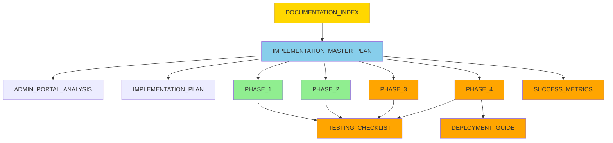

# 📚 HAPPY PLACE WEBSTORE - DOCUMENTATION INDEX

**Last Updated:** December 9, 2025  
**Status:** Complete - Ready for Implementation

---

## 📋 OVERVIEW

This document serves as the central index for all Happy Place Webstore implementation documentation. All documents are modular and interconnected for easy navigation.

---

## 🗂️ DOCUMENTATION STRUCTURE

```
happy_place_webstore/
├── DOCUMENTATION_INDEX.md                    # ← You are here
├── IMPLEMENTATION_MASTER_PLAN.md             # Central hub with progress tracking
├── ADMIN_PORTAL_ANALYSIS_2025-12-09.md      # Detailed analysis report
├── IMPLEMENTATION_PLAN_2025-12-09.md         # Concise implementation summary
│
└── implementation/
    ├── PHASE_1_CRITICAL_FIXES.md             # Week 1-2: Tracking & Fulfillment
    ├── PHASE_2_PORTAL_SEPARATION.md          # Week 3-4: Portal Split
    ├── PHASE_3_ENHANCEMENTS.md               # Week 5: Dashboard & Features (TODO)
    ├── PHASE_4_OPTIMIZATION.md               # Week 6: Performance & Testing (TODO)
    ├── TESTING_CHECKLIST.md                  # Comprehensive testing guide (TODO)
    ├── DEPLOYMENT_GUIDE.md                   # Production deployment (TODO)
    └── SUCCESS_METRICS.md                    # KPIs and measurement (TODO)
```

---

## 📖 DOCUMENT DESCRIPTIONS

### Core Documents

#### 1. **IMPLEMENTATION_MASTER_PLAN.md** ⭐
**Purpose:** Central hub for the entire implementation  
**Contains:**
- Executive summary
- Phase summaries with links
- Progress tracking
- Team roles
- Review schedule
- Sign-off section

**When to use:** Start here for project overview and navigation

---

#### 2. **ADMIN_PORTAL_ANALYSIS_2025-12-09.md**
**Purpose:** Comprehensive analysis of current state  
**Contains:**
- Critical issues (P0)
- High priority issues (P1)
- Medium priority issues (P2)
- Feature completeness matrix
- UX/UI issues
- Security concerns
- Performance issues
- Recommendations

**When to use:** Understanding what needs to be fixed and why

---

#### 3. **IMPLEMENTATION_PLAN_2025-12-09.md**
**Purpose:** Concise implementation summary  
**Contains:**
- Quick phase overview
- Timeline summary
- Key deliverables
- Testing checklist
- Deployment steps

**When to use:** Quick reference for implementation overview

---

### Phase Documents

#### 4. **PHASE_1_CRITICAL_FIXES.md** ✅ COMPLETE
**Duration:** Week 1-2 (10 days)  
**Priority:** P0  
**Contains:**
- Task 1.1: Order Tracking System
  - Database migrations
  - Backend models & API
  - Admin UI
  - Customer tracking page
- Task 1.2: Fulfillment Workflow
  - New employee roles
  - Order assignment system
  - Fulfillment dashboard
  - API endpoints

**When to use:** Implementing order tracking and fulfillment features

---

#### 5. **PHASE_2_PORTAL_SEPARATION.md** ✅ COMPLETE
**Duration:** Week 3-4 (10 days)  
**Priority:** P1  
**Contains:**
- Admin portal setup
- Employee portal setup
- Portal-specific authentication
- Deployment configuration
- Nginx & SSL setup
- DNS configuration

**When to use:** Separating admin and employee portals

---

#### 6. **PHASE_3_ENHANCEMENTS.md** 🔜 TODO
**Duration:** Week 5 (5 days)  
**Priority:** P1-P2  
**Will contain:**
- Activity feed implementation
- Alerts system
- Audit log viewer
- Real-time notifications

**When to use:** Adding dashboard enhancements

---

#### 7. **PHASE_4_OPTIMIZATION.md** 🔜 TODO
**Duration:** Week 6 (5 days)  
**Priority:** P2-P3  
**Will contain:**
- Performance optimization
- Pagination implementation
- Data caching
- Code splitting
- Testing procedures
- Documentation updates

**When to use:** Final optimization and testing

---

### Supporting Documents

#### 8. **TESTING_CHECKLIST.md** 🔜 TODO
**Purpose:** Comprehensive testing guide  
**Will contain:**
- Unit test requirements
- Integration test scenarios
- E2E test cases
- Performance benchmarks
- Security testing
- UAT procedures

**When to use:** Testing each phase and feature

---

#### 9. **DEPLOYMENT_GUIDE.md** 🔜 TODO
**Purpose:** Production deployment procedures  
**Will contain:**
- Pre-deployment checklist
- Deployment steps
- Rollback procedures
- Monitoring setup
- Post-deployment verification

**When to use:** Deploying to production

---

#### 10. **SUCCESS_METRICS.md** 🔜 TODO
**Purpose:** KPIs and measurement criteria  
**Will contain:**
- Technical metrics
- Business metrics
- User satisfaction metrics
- Performance benchmarks
- Tracking methods

**When to use:** Measuring project success

---

## 🚀 QUICK START GUIDE

### For Project Managers
1. Read [IMPLEMENTATION_MASTER_PLAN.md](./IMPLEMENTATION_MASTER_PLAN.md)
2. Review [ADMIN_PORTAL_ANALYSIS_2025-12-09.md](./ADMIN_PORTAL_ANALYSIS_2025-12-09.md)
3. Track progress in master plan
4. Review phase completion

### For Developers
1. Read [IMPLEMENTATION_MASTER_PLAN.md](./IMPLEMENTATION_MASTER_PLAN.md)
2. Go to current phase document (e.g., [PHASE_1_CRITICAL_FIXES.md](./implementation/PHASE_1_CRITICAL_FIXES.md))
3. Follow step-by-step implementation
4. Check off deliverables
5. Run tests from TESTING_CHECKLIST.md

### For QA Engineers
1. Read [ADMIN_PORTAL_ANALYSIS_2025-12-09.md](./ADMIN_PORTAL_ANALYSIS_2025-12-09.md)
2. Review current phase document
3. Use TESTING_CHECKLIST.md for test cases
4. Report issues in project tracker

### For DevOps
1. Read [PHASE_2_PORTAL_SEPARATION.md](./implementation/PHASE_2_PORTAL_SEPARATION.md)
2. Review DEPLOYMENT_GUIDE.md
3. Setup infrastructure
4. Monitor deployments

---

## 📊 DOCUMENTATION STATUS

### Core Documents
| Document | Status | Completion | Last Updated |
|----------|--------|------------|--------------|
| DOCUMENTATION_INDEX.md | ✅ Complete | 100% | 2025-12-09 |
| IMPLEMENTATION_MASTER_PLAN.md | ✅ Complete | 100% | 2025-12-09 |
| ADMIN_PORTAL_ANALYSIS_MASTER.md | ✅ Complete | 100% | 2025-12-09 |
| ADMIN_PORTAL_ANALYSIS_2025-12-09.md | ✅ Complete | 100% | 2025-12-09 |
| IMPLEMENTATION_PLAN_2025-12-09.md | ✅ Complete | 100% | 2025-12-09 |

### Analysis Modules
| Document | Status | Completion | Last Updated |
|----------|--------|------------|--------------|
| P0_CRITICAL_ISSUES.md | ✅ Complete | 100% | 2025-12-09 |
| P1_HIGH_PRIORITY.md | ✅ Complete | 100% | 2025-12-09 |
| P2_MEDIUM_PRIORITY.md | ✅ Complete | 100% | 2025-12-09 |
| FEATURE_COMPLETENESS.md | ✅ Complete | 100% | 2025-12-09 |
| UX_UI_ISSUES.md | ✅ Complete | 100% | 2025-12-09 |
| SECURITY_CONCERNS.md | ✅ Complete | 100% | 2025-12-09 |
| PERFORMANCE_ISSUES.md | ✅ Complete | 100% | 2025-12-09 |
| WORKING_WELL.md | ✅ Complete | 100% | 2025-12-09 |

### Implementation Phases
| Document | Status | Completion | Last Updated |
|----------|--------|------------|--------------|
| PHASE_1_CRITICAL_FIXES.md | ✅ Complete | 100% | 2025-12-09 |
| PHASE_2_PORTAL_SEPARATION.md | ✅ Complete | 100% | 2025-12-09 |
| PHASE_3_ENHANCEMENTS.md | 🔜 Pending | 0% | - |
| PHASE_4_OPTIMIZATION.md | 🔜 Pending | 0% | - |

### Supporting Documents
| Document | Status | Completion | Last Updated |
|----------|--------|------------|--------------|
| TESTING_CHECKLIST.md | 🔜 Pending | 0% | - |
| DEPLOYMENT_GUIDE.md | 🔜 Pending | 0% | - |
| SUCCESS_METRICS.md | 🔜 Pending | 0% | - |

**Overall Documentation:** 82% Complete (18 of 22 documents)

---

## 🔄 DOCUMENT RELATIONSHIPS



**Legend:**
- 🟡 Gold: Index (You are here)
- 🔵 Blue: Master Plan (Central hub)
- 🟢 Green: Complete phases
- 🟠 Orange: Pending documents

---

## 📝 DOCUMENT CONVENTIONS

### File Naming
- Use UPPERCASE for main documents
- Use descriptive names
- Include dates for time-sensitive docs
- Use underscores for spaces

### Structure
- Start with metadata (date, status, priority)
- Include table of contents for long docs
- Use consistent heading levels
- Add navigation links at bottom

### Formatting
- Use emojis for visual clarity
- Include code blocks with syntax highlighting
- Add diagrams where helpful
- Use tables for comparisons

### Cross-References
- Link to related documents
- Reference specific sections
- Keep links relative
- Update links when moving files

---

## 🔍 FINDING INFORMATION

### By Topic

**Order Tracking:**
- Analysis: [ADMIN_PORTAL_ANALYSIS_2025-12-09.md](./ADMIN_PORTAL_ANALYSIS_2025-12-09.md#1-no-order-tracking-system)
- Implementation: [PHASE_1_CRITICAL_FIXES.md](./implementation/PHASE_1_CRITICAL_FIXES.md#task-11-order-tracking-system)

**Fulfillment Workflow:**
- Analysis: [ADMIN_PORTAL_ANALYSIS_2025-12-09.md](./ADMIN_PORTAL_ANALYSIS_2025-12-09.md#2-no-fulfillment-workflow)
- Implementation: [PHASE_1_CRITICAL_FIXES.md](./implementation/PHASE_1_CRITICAL_FIXES.md#task-12-fulfillment-workflow)

**Portal Separation:**
- Analysis: [ADMIN_PORTAL_ANALYSIS_2025-12-09.md](./ADMIN_PORTAL_ANALYSIS_2025-12-09.md#3-mixed-adminemployee-portal)
- Implementation: [PHASE_2_PORTAL_SEPARATION.md](./implementation/PHASE_2_PORTAL_SEPARATION.md)

**Dashboard Issues:**
- Analysis: [ADMIN_PORTAL_ANALYSIS_2025-12-09.md](./ADMIN_PORTAL_ANALYSIS_2025-12-09.md#4-dashboard-metrics-not-fully-implemented)
- Implementation: PHASE_3_ENHANCEMENTS.md (TODO)

### By Role

**Project Manager:**
- [IMPLEMENTATION_MASTER_PLAN.md](./IMPLEMENTATION_MASTER_PLAN.md)
- [SUCCESS_METRICS.md](./implementation/SUCCESS_METRICS.md) (TODO)

**Developer:**
- [PHASE_1_CRITICAL_FIXES.md](./implementation/PHASE_1_CRITICAL_FIXES.md)
- [PHASE_2_PORTAL_SEPARATION.md](./implementation/PHASE_2_PORTAL_SEPARATION.md)

**QA Engineer:**
- [TESTING_CHECKLIST.md](./implementation/TESTING_CHECKLIST.md) (TODO)
- Phase documents (testing sections)

**DevOps:**
- [PHASE_2_PORTAL_SEPARATION.md](./implementation/PHASE_2_PORTAL_SEPARATION.md#task-24-deployment-configuration)
- [DEPLOYMENT_GUIDE.md](./implementation/DEPLOYMENT_GUIDE.md) (TODO)

---

## 🆘 NEED HELP?

### Documentation Issues
- Missing information? Create an issue
- Broken links? Report in project tracker
- Unclear instructions? Request clarification

### Technical Questions
- Backend: Contact Backend Lead
- Frontend: Contact Frontend Lead
- DevOps: Contact DevOps Lead

### Process Questions
- Project Manager for timeline/scope
- Technical Lead for architecture
- Product Owner for requirements

---

## 📅 MAINTENANCE SCHEDULE

### Weekly
- Update progress in master plan
- Check off completed tasks
- Update status indicators

### Phase Completion
- Mark phase as complete
- Update metrics
- Archive old versions

### Monthly
- Review all documentation
- Update outdated information
- Consolidate lessons learned

---

## 🎯 NEXT STEPS

1. **Immediate:**
   - Review [IMPLEMENTATION_MASTER_PLAN.md](./IMPLEMENTATION_MASTER_PLAN.md)
   - Read [ADMIN_PORTAL_ANALYSIS_2025-12-09.md](./ADMIN_PORTAL_ANALYSIS_2025-12-09.md)
   - Start [PHASE_1_CRITICAL_FIXES.md](./implementation/PHASE_1_CRITICAL_FIXES.md)

2. **This Week:**
   - Complete Phase 1 Task 1.1 (Order Tracking)
   - Begin Phase 1 Task 1.2 (Fulfillment)

3. **Next Week:**
   - Complete Phase 1
   - Begin Phase 2 planning

4. **Create Remaining Docs:**
   - PHASE_3_ENHANCEMENTS.md
   - PHASE_4_OPTIMIZATION.md
   - TESTING_CHECKLIST.md
   - DEPLOYMENT_GUIDE.md
   - SUCCESS_METRICS.md

---

**Happy Coding! 🚀**

*This documentation is a living resource. Keep it updated as the project evolves.*
