# Order Fulfillment Workflow - Mermaid Diagrams

**Interactive visual diagrams of the complete fulfillment process**

---

## 🎯 **COMPLETE WORKFLOW - SEQUENCE DIAGRAM**

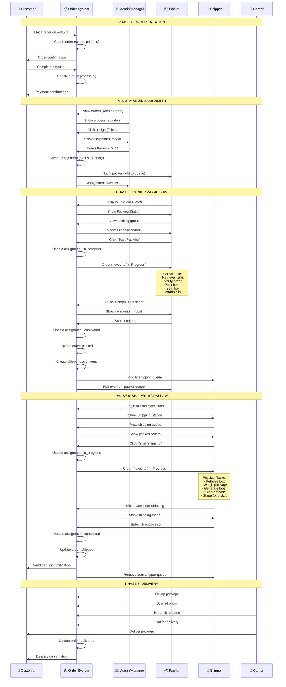

---

## 🔄 **STATE MACHINE - ORDER STATUS**

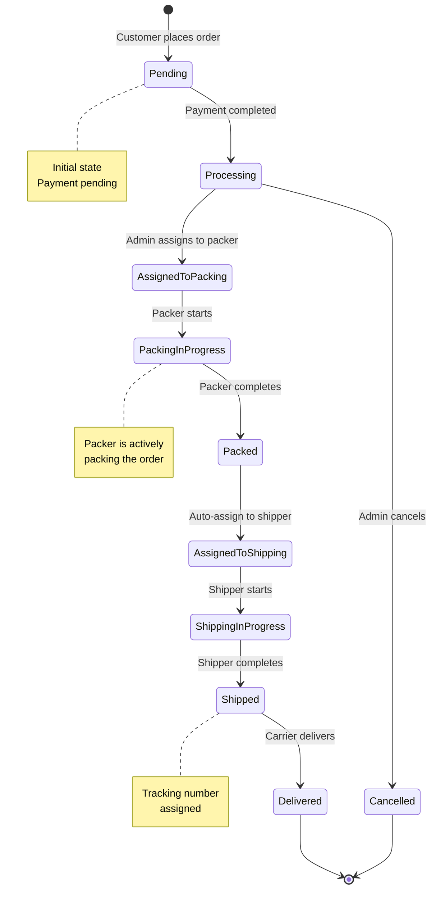

---

## 👥 **ACTOR INTERACTIONS - FLOWCHART**

```mermaid
flowchart TD
    Start([Order Created]) --> Payment{Payment<br/>Successful?}
    Payment -->|No| Failed([Order Failed])
    Payment -->|Yes| Processing[Order Status:<br/>Processing]
    
    Processing --> AdminView[Admin Views<br/>Orders Page]
    AdminView --> AdminSelect[Admin Selects<br/>Processing Order]
    AdminSelect --> AdminAssign[Admin Clicks<br/>Assign 👤 Icon]
    AdminAssign --> SelectPacker[Select Role: Packer<br/>Employee: John Packer]
    SelectPacker --> AssignDB[(Create Assignment<br/>in Database)]
    AssignDB --> PackerQueue[Add to<br/>Packer Queue]
    
    PackerQueue --> PackerLogin[Packer Logs In<br/>Employee Portal]
    PackerLogin --> PackerDash[Packing Station<br/>Dashboard]
    PackerDash --> PackerView[View Pending<br/>Orders]
    PackerView --> PackerStart{Packer Clicks<br/>Start Packing}
    PackerStart --> PackerProgress[Status:<br/>In Progress]
    PackerProgress --> PhysicalPack[Physical Packing:<br/>Retrieve, Verify,<br/>Pack, Seal]
    PhysicalPack --> PackerComplete{Packer Clicks<br/>Complete Packing}
    PackerComplete --> PackerNotes[Add Packing<br/>Notes]
    PackerNotes --> UpdatePacked[(Update Order:<br/>Packed)]
    UpdatePacked --> CreateShipper[(Auto-Create<br/>Shipper Assignment)]
    CreateShipper --> ShipperQueue[Add to<br/>Shipper Queue]
    
    ShipperQueue --> ShipperLogin[Shipper Logs In<br/>Employee Portal]
    ShipperLogin --> ShipperDash[Shipping Station<br/>Dashboard]
    ShipperDash --> ShipperView[View Packed<br/>Orders]
    ShipperView --> ShipperStart{Shipper Clicks<br/>Start Shipping}
    ShipperStart --> ShipperProgress[Status:<br/>In Progress]
    ShipperProgress --> PhysicalShip[Physical Shipping:<br/>Weigh, Label,<br/>Scan, Stage]
    PhysicalShip --> ShipperComplete{Shipper Clicks<br/>Complete Shipping}
    ShipperComplete --> ShipperTracking[Enter Tracking<br/>Number & Carrier]
    ShipperTracking --> UpdateShipped[(Update Order:<br/>Shipped)]
    UpdateShipped --> NotifyCustomer[Send Customer<br/>Notification]
    NotifyCustomer --> CarrierPickup[Carrier Picks Up<br/>Package]
    CarrierPickup --> InTransit[In Transit]
    InTransit --> Delivered([Delivered to<br/>Customer])
    
    style Start fill:#90EE90
    style Failed fill:#FFB6C1
    style Delivered fill:#87CEEB
    style AssignDB fill:#FFE4B5
    style UpdatePacked fill:#FFE4B5
    style CreateShipper fill:#FFE4B5
    style UpdateShipped fill:#FFE4B5
```

---

## 🗂️ **QUEUE MANAGEMENT - FLOWCHART**

```mermaid
flowchart LR
    subgraph AdminPortal[Admin Portal]
        A1[View Orders] --> A2[Select Order]
        A2 --> A3[Click Assign 👤]
        A3 --> A4[Choose Packer]
        A4 --> A5[Submit Assignment]
    end
    
    subgraph PackerQueue[Packer Queue]
        direction TB
        P1[Pending Tab] --> P2[In Progress Tab]
        P2 --> P3[Completed Tab]
        
        P1 -.->|Start Packing| P2
        P2 -.->|Complete| P3
    end
    
    subgraph ShipperQueue[Shipper Queue]
        direction TB
        S1[Pending Tab] --> S2[In Progress Tab]
        S2 --> S3[Completed Tab]
        
        S1 -.->|Start Shipping| S2
        S2 -.->|Complete| S3
    end
    
    A5 -->|Assignment Created| P1
    P3 -->|Auto-Assign| S1
    
    style AdminPortal fill:#E6F3FF
    style PackerQueue fill:#FFF4E6
    style ShipperQueue fill:#E6FFE6
```

---

## 🔐 **ROLE-BASED ACCESS - DIAGRAM**

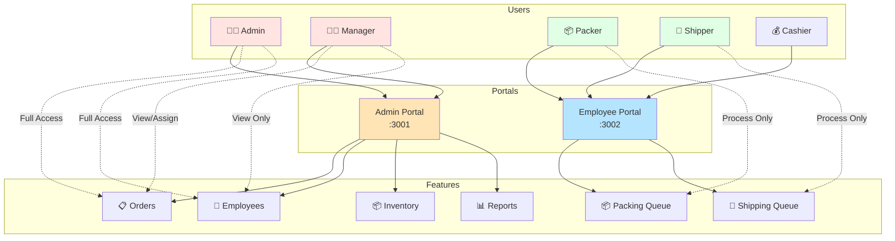

---

## 📊 **DATABASE RELATIONSHIPS - ERD**

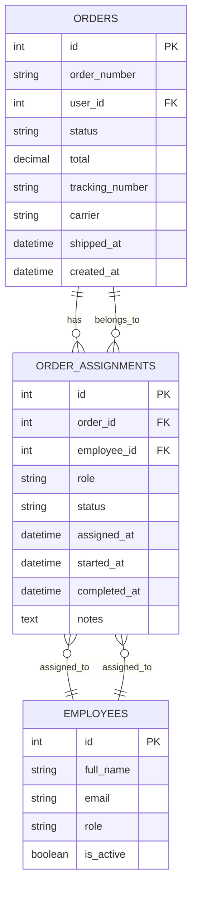

---

## ⏱️ **TIMELINE - GANTT CHART**

```mermaid
gantt
    title Order Fulfillment Timeline
    dateFormat HH:mm
    axisFormat %H:%M
    
    section Customer
    Place Order           :done, c1, 10:00, 10:05
    Receive Tracking      :done, c2, 10:50, 10:51
    Receive Package       :crit, c3, 14:00, 14:05
    
    section Admin
    Review Order          :done, a1, 10:05, 10:08
    Assign to Packer      :done, a2, 10:08, 10:10
    
    section Packer
    View Queue            :done, p1, 10:10, 10:12
    Start Packing         :done, p2, 10:12, 10:13
    Physical Packing      :active, p3, 10:13, 10:28
    Complete Packing      :p4, 10:28, 10:30
    
    section Shipper
    View Queue            :s1, 10:30, 10:32
    Start Shipping        :s2, 10:32, 10:33
    Physical Shipping     :s3, 10:33, 10:48
    Complete Shipping     :s4, 10:48, 10:50
    
    section Carrier
    Pickup                :d1, 11:00, 11:15
    In Transit            :d2, 11:15, 14:00
    Delivery              :crit, d3, 14:00, 14:05
```

---

## 🎯 **DECISION TREE - ASSIGNMENT LOGIC**

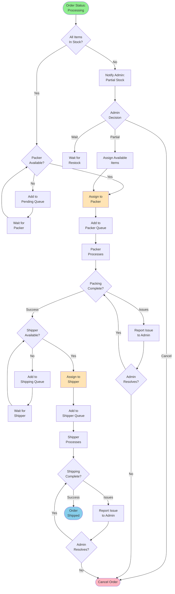

---

## 🔄 **PACKER WORKFLOW - DETAILED**

```mermaid
flowchart TD
    Start([Packer Logs In]) --> Dashboard[Packing Station<br/>Dashboard]
    Dashboard --> ViewQueue[View Pending<br/>Orders Tab]
    ViewQueue --> SelectOrder{Select<br/>Order}
    
    SelectOrder --> OrderDetails[View Order<br/>Details]
    OrderDetails --> CheckItems{All Items<br/>Clear?}
    CheckItems -->|No| ContactAdmin[Contact Admin]
    ContactAdmin --> SelectOrder
    
    CheckItems -->|Yes| StartPacking[Click<br/>Start Packing]
    StartPacking --> UpdateStatus[(Update Status:<br/>In Progress)]
    UpdateStatus --> MoveTab[Move to<br/>In Progress Tab]
    
    MoveTab --> Physical[Physical Tasks]
    
    subgraph Physical[Physical Packing Process]
        direction TB
        T1[Retrieve Items<br/>from Inventory] --> T2[Verify Against<br/>Order]
        T2 --> T3[Check for<br/>Damage/Defects]
        T3 --> T4[Wrap Items<br/>Securely]
        T4 --> T5[Place in<br/>Shipping Box]
        T5 --> T6[Add Packing<br/>Materials]
        T6 --> T7[Seal Box<br/>with Tape]
        T7 --> T8[Attach Packing<br/>Slip]
    end
    
    Physical --> QualityCheck{Quality<br/>Check Pass?}
    QualityCheck -->|No| Repack[Repack<br/>Order]
    Repack --> Physical
    
    QualityCheck -->|Yes| Complete[Click<br/>Complete Packing]
    Complete --> NotesModal[Add Packing<br/>Notes Modal]
    NotesModal --> EnterNotes[Enter Notes:<br/>Condition, Issues]
    EnterNotes --> Submit[Click<br/>Submit]
    Submit --> UpdateComplete[(Update Status:<br/>Completed)]
    UpdateComplete --> RemoveQueue[Remove from<br/>Packer Queue]
    RemoveQueue --> CreateShipper[(Create Shipper<br/>Assignment)]
    CreateShipper --> End([Order Ready<br/>for Shipping])
    
    style Start fill:#90EE90
    style End fill:#87CEEB
    style UpdateStatus fill:#FFE4B5
    style UpdateComplete fill:#FFE4B5
    style CreateShipper fill:#FFE4B5
    style Physical fill:#FFF4E6
```

---

## 🚚 **SHIPPER WORKFLOW - DETAILED**

```mermaid
flowchart TD
    Start([Shipper Logs In]) --> Dashboard[Shipping Station<br/>Dashboard]
    Dashboard --> ViewQueue[View Pending<br/>Orders Tab]
    ViewQueue --> SelectOrder{Select<br/>Packed Order}
    
    SelectOrder --> OrderDetails[View Order<br/>& Packing Info]
    OrderDetails --> VerifyPacking{Packing<br/>Verified?}
    VerifyPacking -->|Issues| ContactPacker[Contact Packer/<br/>Admin]
    ContactPacker --> SelectOrder
    
    VerifyPacking -->|OK| StartShipping[Click<br/>Start Shipping]
    StartShipping --> UpdateStatus[(Update Status:<br/>In Progress)]
    UpdateStatus --> MoveTab[Move to<br/>In Progress Tab]
    
    MoveTab --> Physical[Physical Tasks]
    
    subgraph Physical[Physical Shipping Process]
        direction TB
        S1[Retrieve Packed<br/>Box] --> S2[Verify Packing<br/>Slip]
        S2 --> S3[Weigh<br/>Package]
        S3 --> S4[Select Shipping<br/>Carrier]
        S4 --> S5[Generate Shipping<br/>Label]
        S5 --> S6[Print Label]
        S6 --> S7[Attach Label<br/>to Box]
        S7 --> S8[Scan Tracking<br/>Barcode]
        S8 --> S9[Stage for<br/>Carrier Pickup]
    end
    
    Physical --> LabelCheck{Label<br/>Correct?}
    LabelCheck -->|No| ReprintLabel[Reprint<br/>Label]
    ReprintLabel --> Physical
    
    LabelCheck -->|Yes| Complete[Click<br/>Complete Shipping]
    Complete --> ShippingModal[Shipping Details<br/>Modal]
    ShippingModal --> EnterTracking[Enter Tracking<br/>Number]
    EnterTracking --> SelectCarrier[Select Carrier:<br/>DHL, FedEx, etc.]
    SelectCarrier --> EnterNotes[Enter Shipping<br/>Notes]
    EnterNotes --> Submit[Click<br/>Submit]
    Submit --> UpdateComplete[(Update Status:<br/>Completed)]
    UpdateComplete --> UpdateOrder[(Update Order:<br/>Shipped)]
    UpdateOrder --> SaveTracking[(Save Tracking<br/>Info)]
    SaveTracking --> NotifyCustomer[Send Customer<br/>Notification]
    NotifyCustomer --> RemoveQueue[Remove from<br/>Shipper Queue]
    RemoveQueue --> End([Order<br/>Shipped])
    
    style Start fill:#90EE90
    style End fill:#87CEEB
    style UpdateStatus fill:#FFE4B5
    style UpdateComplete fill:#FFE4B5
    style UpdateOrder fill:#FFE4B5
    style SaveTracking fill:#FFE4B5
    style Physical fill:#E6FFE6
```

---

## 📱 **USER INTERFACE FLOW**

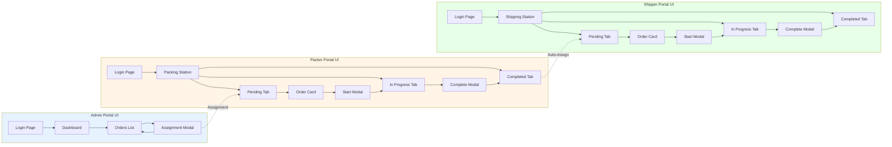

---

## 🎯 **SUCCESS METRICS - PIE CHART**

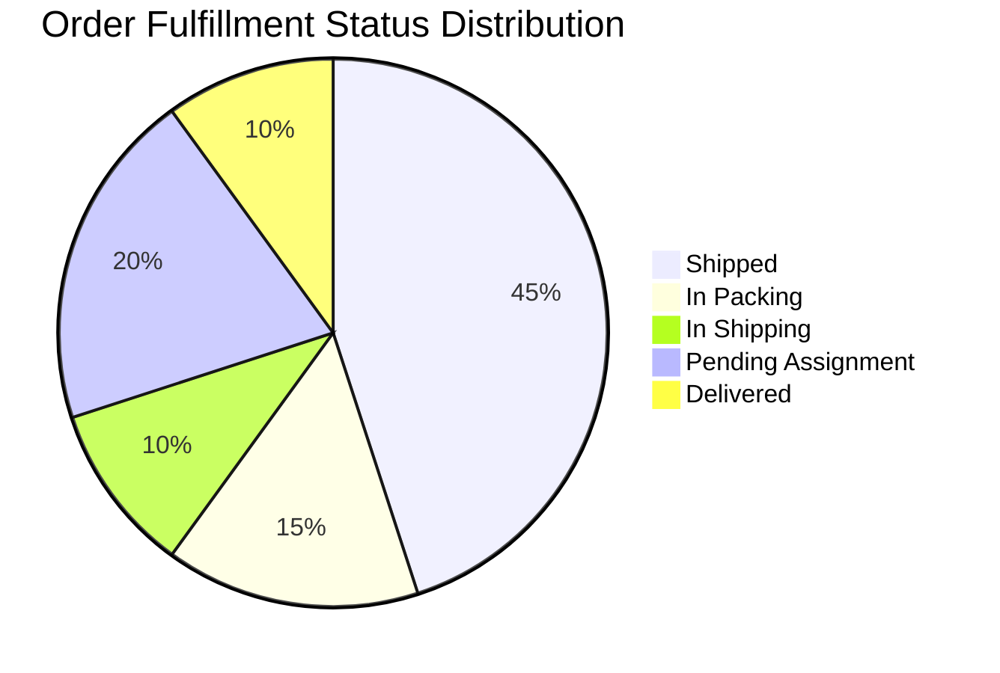

---

## 📈 **PERFORMANCE TIMELINE**

```mermaid
timeline
    title Order Fulfillment Journey
    section Order Placement
        10:00 : Customer places order
        10:02 : Payment processed
        10:05 : Order confirmed
    section Assignment
        10:08 : Admin reviews order
        10:10 : Assigned to packer
    section Packing
        10:12 : Packer starts
        10:15 : Items retrieved
        10:20 : Items packed
        10:28 : Packing complete
    section Shipping
        10:32 : Shipper starts
        10:35 : Label generated
        10:45 : Package staged
        10:50 : Shipping complete
    section Delivery
        11:00 : Carrier pickup
        13:00 : In transit
        14:00 : Delivered
```

---

**These Mermaid diagrams provide interactive, visual representations of the entire order fulfillment workflow!** 🎨

**To view these diagrams:**
1. Copy any diagram code
2. Paste into [Mermaid Live Editor](https://mermaid.live)
3. Or view in any Markdown viewer that supports Mermaid (GitHub, GitLab, VS Code with extension)
