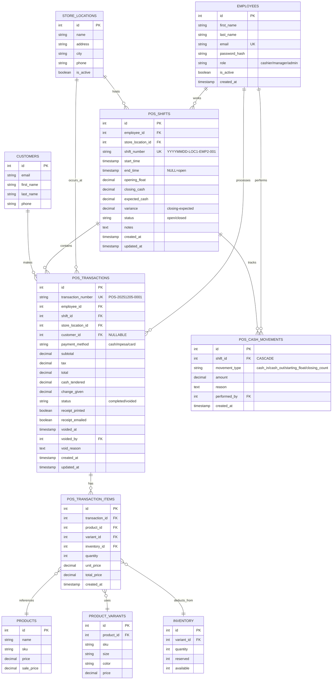
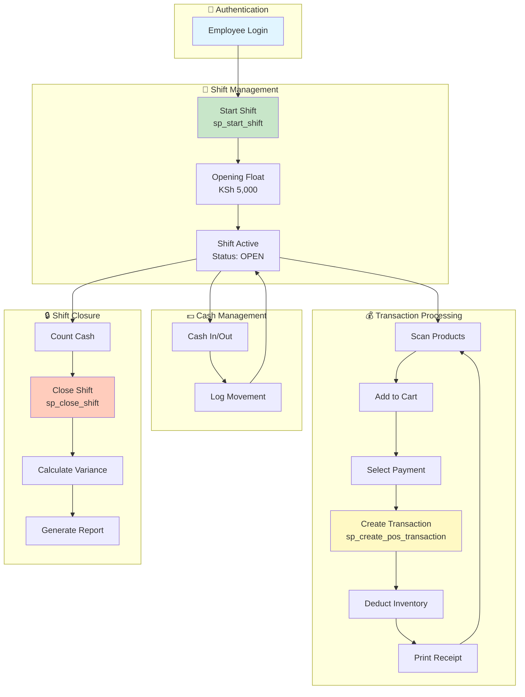
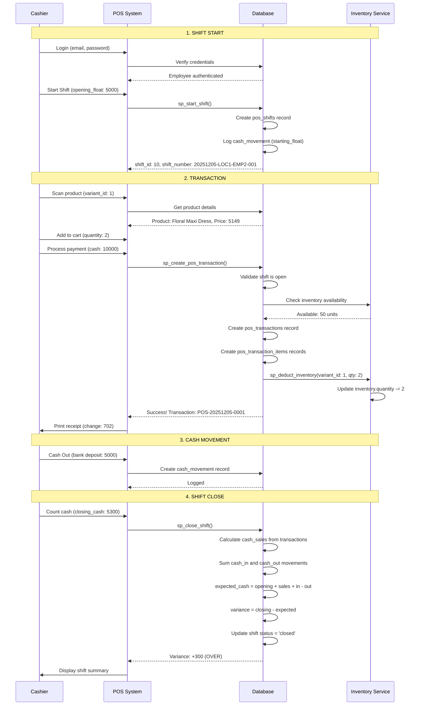
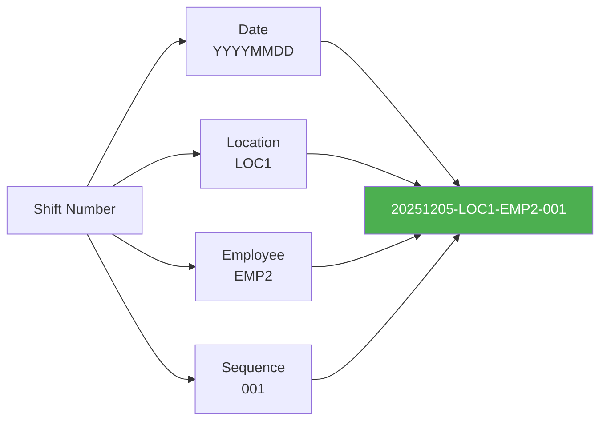
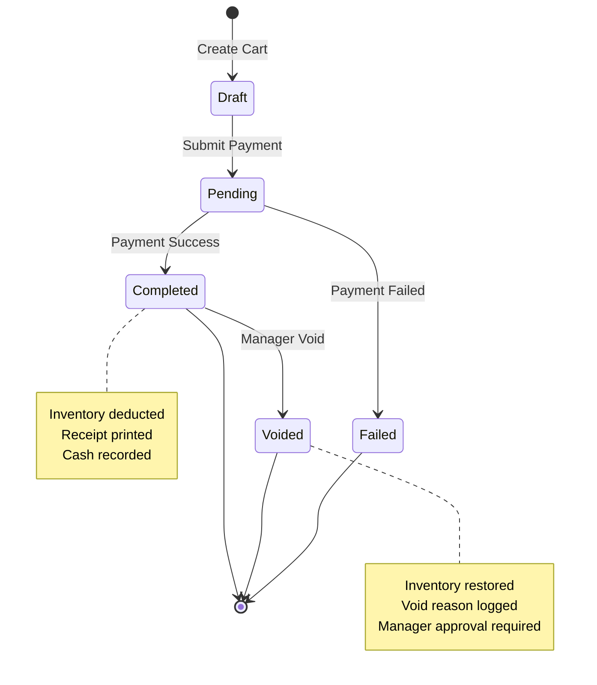
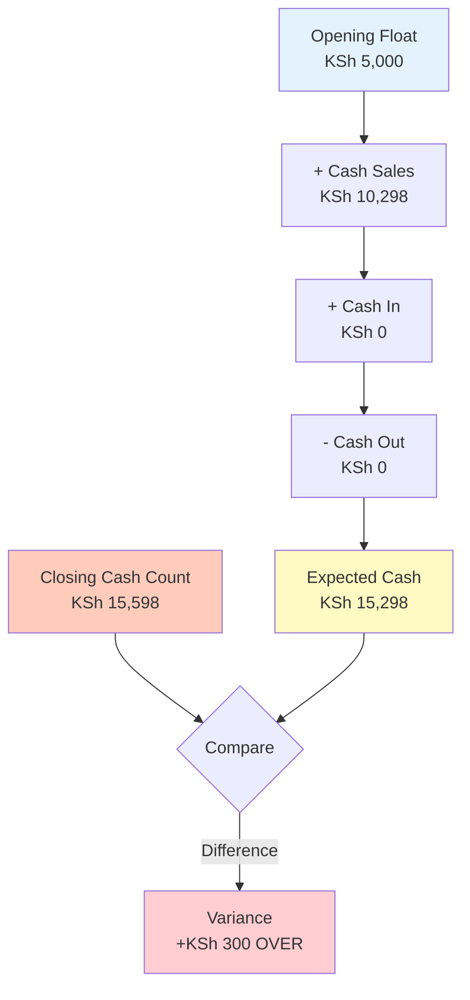
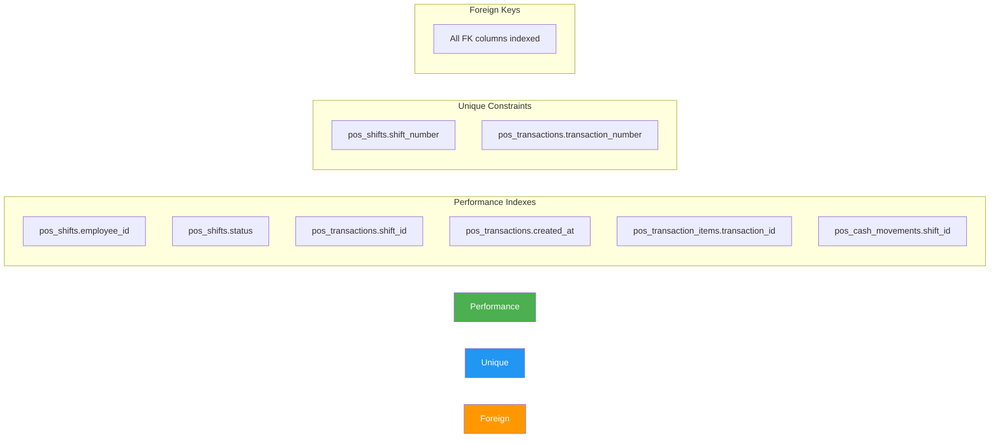

# 🏪 POS System - Visual ERD

## Entity Relationship Diagram

---

## Simplified Flow Diagram

---

## Data Flow Sequence

---

## Smart Shift Numbering

**Benefits:**
- 📅 **Date Filtering:** Easily find shifts by date
- 🏪 **Location Tracking:** Filter by store location
- 👤 **Employee Performance:** Track individual cashier metrics
- 🔢 **Sequence:** Identify shift order for the day

---

## Transaction States

---

## Cash Reconciliation Formula

**Variance Interpretation:**
- ✅ **Zero variance:** Perfect reconciliation
- ⚠️ **Positive variance (+300):** Cash OVER - Extra money in drawer
- ❌ **Negative variance (-300):** Cash SHORT - Missing money

---

## Stored Procedures Flow

```mermaid
graph TB
    subgraph sp_start_shift
        SS1[Check no open shift]
        SS2[Generate shift number]
        SS3[Create pos_shifts record]
        SS4[Log opening_float]
        SS1 --> SS2 --> SS3 --> SS4
    end
    
    subgraph sp_create_pos_transaction
        CT1[Validate shift is open]
        CT2[Check inventory]
        CT3[Calculate totals]
        CT4[Create transaction]
        CT5[Create items]
        CT6[Deduct inventory]
        CT1 --> CT2 --> CT3 --> CT4 --> CT5 --> CT6
    end
    
    subgraph sp_void_pos_transaction
        VT1[Check not already voided]
        VT2[Verify manager role]
        VT3[Restore inventory]
        VT4[Mark as voided]
        VT1 --> VT2 --> VT3 --> VT4
    end
    
    subgraph sp_close_shift
        CS1[Get shift details]
        CS2[Calculate cash sales]
        CS3[Sum cash movements]
        CS4[Calculate expected]
        CS5[Calculate variance]
        CS6[Update shift closed]
        CS1 --> CS2 --> CS3 --> CS4 --> CS5 --> CS6
    end
    
    style sp_start_shift fill:#c8e6c9
    style sp_create_pos_transaction fill:#fff9c4
    style sp_void_pos_transaction fill:#ffccbc
    style sp_close_shift fill:#e1bee7
```

---

## Index Strategy

---

## View this diagram in your IDE

Most modern IDEs and GitHub support Mermaid rendering. If you're viewing this in:
- **VS Code:** Install "Markdown Preview Mermaid Support" extension
- **GitHub:** Diagrams render automatically
- **Online:** Copy to https://mermaid.live/

---

**Created:** December 5, 2025  
**Version:** 1.0  
**Database Schema:** 005_pos_enhancements.sql
