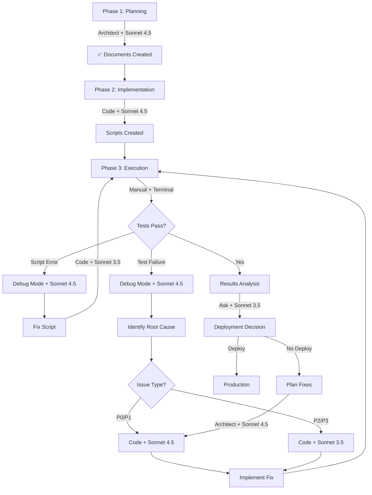

# UAT Mode & Model Selection Guide
## Happy Place Webstore - Best Practices for Test Implementation & Execution

**Purpose:** Recommend optimal Kilo Code modes and AI models for each phase of UAT  
**Created:** December 8, 2025

---

## Quick Recommendation Summary

| Phase | Recommended Mode | Recommended Model | Rationale |
|-------|------------------|-------------------|-----------|
| **Planning** | Architect | Claude Sonnet 4.5 | ✅ COMPLETED |
| **Script Implementation** | **Code** | **Claude Sonnet 4.5** | Best for complex coding |
| **Debugging Failures** | **Debug** | **Claude Sonnet 4.5** | Systematic issue resolution |
| **Results Analysis** | Ask or Architect | Claude Sonnet 3.5 | Fast, cost-effective |
| **Fix Implementation** | Code | Claude Sonnet 4.5 | Critical changes |

---

## Phase-by-Phase Recommendations

### Phase 1: UAT Planning ✅ COMPLETE
**Mode Used:** Architect  
**Model Used:** Claude Sonnet 4.5  
**Result:** 4 comprehensive planning documents created

**Why This Was Optimal:**
- Architect mode excels at planning and strategy
- Created detailed specifications without implementation
- Analyzed project holistically
- Designed comprehensive test structure

---

### Phase 2: Test Script Implementation ⏳ NEXT STEP

#### **Recommended: Code Mode + Claude Sonnet 4.5**

**Why Code Mode:**
- ✅ Can create/edit `.sh` files (bash scripts)
- ✅ Specialized in writing clean, efficient code
- ✅ Focus on implementation details
- ✅ Handles syntax and best practices
- ✅ Can test code as it's written

**Why Claude Sonnet 4.5:**
- ✅ Best reasoning for complex logic
- ✅ Excellent at bash scripting
- ✅ Understands API testing patterns
- ✅ Can handle JSON parsing complexities
- ✅ Best error handling implementation
- ❌ Higher cost (~$3/million tokens input)

**Alternative: Code Mode + Claude Sonnet 3.5**
- ✅ Good bash scripting ability
- ✅ Faster responses
- ✅ Lower cost (~$0.80/million tokens input)
- ⚠️ May need more iterations for complex logic
- **Recommended If:** Budget constrained or scripts are straightforward

**How to Switch:**
```
Prompt: "Switch to Code mode to implement the UAT test scripts 
according to UAT_TEST_SCRIPTS_SPECIFICATION.md"
```

**Implementation Order:**
1. `uat_helpers.sh` (2 hours) - Foundation functions
2. `uat_smoke_tests.sh` (1 hour) - Quick validation
3. `uat_regression_tests.sh` (1.5 hours) - P0 fix testing
4. `uat_comprehensive_2025.sh` (3.5 hours) - Full suite

**Total Time:** ~8 hours with Sonnet 4.5 (may be 10-12 hours with Sonnet 3.5)

---

### Phase 3: Initial Testing & Debugging ⏳ AFTER IMPLEMENTATION

#### **Recommended: Debug Mode + Claude Sonnet 4.5**

**Why Debug Mode:**
- ✅ Specialized in systematic troubleshooting
- ✅ Excellent at analyzing error messages
- ✅ Can trace through script execution
- ✅ Identifies root causes effectively
- ✅ Suggests targeted fixes

**Why Claude Sonnet 4.5:**
- ✅ Best debugging reasoning
- ✅ Understands complex error chains
- ✅ Can analyze bash script failures
- ✅ Excellent at API error diagnosis

**When to Use:**
- Script syntax errors
- Unexpected test failures
- JSON parsing issues
- API response errors
- Database connection problems

**How to Switch:**
```
Prompt: "Switch to Debug mode. I'm getting an error when running 
uat_smoke_tests.sh. Here's the error: [paste error]"
```

**Alternative: Code Mode for Simple Fixes**
- Use Code mode if error is obvious (typo, missing variable)
- Use Debug mode if error is complex or unclear

---

### Phase 4: UAT Execution & Monitoring

#### **Recommended: Manual Execution + Code/Debug Mode for Issues**

**Execution Approach:**
```bash
# Run scripts manually in terminal
cd tests
./uat_smoke_tests.sh

# Monitor output in real-time
# If issues appear, use Debug mode to investigate
```

**When to Use AI:**
- ✅ Script fails to execute
- ✅ Unexpected test failures
- ✅ Performance issues
- ✅ Need to interpret results
- ❌ Don't need AI for successful test runs

**Model Choice During Execution:**
- **Debug Mode + Sonnet 4.5** for complex failures
- **Code Mode + Sonnet 3.5** for simple script fixes
- **Ask Mode + Sonnet 3.5** for interpreting outputs

---

### Phase 5: Results Analysis & Reporting

#### **Recommended: Ask Mode + Claude Sonnet 3.5**

**Why Ask Mode:**
- ✅ Great for analysis and explanation
- ✅ Can interpret test results
- ✅ Provides recommendations
- ✅ No file editing needed
- ✅ Fast responses

**Why Claude Sonnet 3.5:**
- ✅ Sufficient for analysis tasks
- ✅ Very fast (2-3x faster than 4.5)
- ✅ Much cheaper (1/4 the cost)
- ✅ Good at pattern recognition in logs
- ⚠️ May miss subtle issues (use 4.5 if critical)

**When to Use:**
```
Prompt: "Analyze these UAT test results and tell me:
1. What are the critical failures?
2. Should we deploy to production?
3. What needs to be fixed first?

[Paste test summary]"
```

**Alternative: Architect Mode + Sonnet 4.5**
- Use if creating comprehensive analysis documents
- Use if planning remediation strategy
- Use if need strategic recommendations

---

### Phase 6: Issue Remediation

#### **Recommended: Code Mode + Claude Sonnet 4.5**

**Why Code Mode:**
- ✅ Fixing backend code (Python)
- ✅ Updating stored procedures (SQL)
- ✅ Modifying API routes
- ✅ Adjusting business logic

**Why Claude Sonnet 4.5:**
- ✅ Critical fixes require best reasoning
- ✅ Complex business logic changes
- ✅ Database operations need precision
- ✅ Want to avoid introducing new bugs

**Issue-Based Mode Selection:**

| Issue Type | Mode | Model | Why |
|------------|------|-------|-----|
| **P0 Critical Bug** | Code | Sonnet 4.5 | Best quality, can't risk errors |
| **P1 Feature Bug** | Code | Sonnet 4.5 | Important quality |
| **P2 Enhancement** | Code | Sonnet 3.5 | Good enough, save cost |
| **P3 Nice-to-Have** | Code | Sonnet 3.5 | Not time-critical |
| **Root Cause Unknown** | Debug | Sonnet 4.5 | Need best debugging |
| **Configuration Issue** | Ask/Code | Sonnet 3.5 | Simple changes |

---

## Detailed Mode Capabilities

### Architect Mode (Current)
**Best For:**
- ✅ High-level planning and strategy
- ✅ System design and architecture
- ✅ Creating comprehensive documentation
- ✅ Analyzing complex requirements
- ✅ Breaking down large projects

**Limitations:**
- ❌ Can only edit Markdown files
- ❌ Cannot create .sh, .py, .sql files
- ❌ Not ideal for implementation

**When to Use for UAT:**
- Initial planning (done ✅)
- Post-UAT strategy updates
- Creating remediation plans
- Architectural recommendations

---

### Code Mode
**Best For:**
- ✅ Writing new code (any language)
- ✅ Modifying existing code
- ✅ Creating test scripts
- ✅ Implementing features
- ✅ Refactoring

**Ideal for UAT:**
- ✅ Implementing bash test scripts
- ✅ Fixing backend bugs found in UAT
- ✅ Updating API routes
- ✅ Modifying stored procedures
- ✅ Creating helper utilities

**Model Recommendations:**
- **Claude Sonnet 4.5** for:
  - Complex logic (stored procedures, business rules)
  - Critical fixes (P0/P1 issues)
  - New feature implementation
  - Security-sensitive code
  
- **Claude Sonnet 3.5** for:
  - Simple bug fixes
  - Configuration changes
  - Minor enhancements
  - P2/P3 issues

**Cost Consideration:**
- Sonnet 4.5: ~$3 input / $15 output per million tokens
- Sonnet 3.5: ~$0.80 input / $4 output per million tokens
- **Savings:** 60-75% with Sonnet 3.5
- **Trade-off:** May need more iterations

---

### Debug Mode
**Best For:**
- ✅ Systematic troubleshooting
- ✅ Analyzing error messages
- ✅ Investigating test failures
- ✅ Root cause analysis
- ✅ Performance issues

**Ideal for UAT:**
- ✅ When script execution fails
- ✅ When P0 tests fail
- ✅ When error cause is unclear
- ✅ Complex API error chains
- ✅ Database constraint violations
- ✅ Authentication failures

**Model Recommendations:**
- **Always use Claude Sonnet 4.5**
  - Debugging requires best reasoning
  - Complex error chains need deep analysis
  - Cost of wrong diagnosis > model cost
  - Critical to find root cause quickly

**Example Usage:**
```
Scenario: POS transaction creation fails with HTTP 400

Debug Mode Workflow:
1. Analyze error response
2. Check request payload format
3. Review stored procedure
4. Examine database constraints
5. Test in isolation
6. Identify root cause
7. Suggest fix

Code Mode would just try to fix immediately.
Architect Mode would plan but not debug.
Debug Mode systematically investigates.
```

---

### Ask Mode
**Best For:**
- ✅ Getting explanations
- ✅ Understanding concepts
- ✅ Analyzing results
- ✅ Recommendations
- ✅ Documentation help

**Ideal for UAT:**
- ✅ Interpreting test results
- ✅ Understanding failure patterns
- ✅ Getting deployment recommendations
- ✅ Explaining API errors
- ✅ Best practices advice

**Model Recommendations:**
- **Claude Sonnet 3.5** for:
  - Result interpretation
  - Documentation queries
  - General explanations
  - Historical comparisons
  
- **Claude Sonnet 4.5** for:
  - Complex analysis
  - Strategic recommendations
  - Critical decision making
  - Risk assessment

---

## Recommended Workflow

### Complete UAT Process (Optimized)



### Cost-Optimized Workflow

**Total UAT Process Cost Estimate:**

**Using All Sonnet 4.5:**
- Planning: $2 (done ✅)
- Implementation: $8-12
- Debugging: $5-10
- Fixes: $10-20
- **Total: $25-44**

**Using Hybrid Approach (Recommended):**
- Planning: $2 (Sonnet 4.5 ✅)
- Implementation: $8-12 (Sonnet 4.5 - complex logic)
- Debugging: $5-10 (Sonnet 4.5 - need accuracy)
- Simple Fixes: $2-4 (Sonnet 3.5 - save 75%)
- Analysis: $1-2 (Sonnet 3.5 - save 75%)
- **Total: $18-30** (Save up to 40%)

---

## Specific Recommendations for Your UAT

### Step 1: Implement Test Scripts
**Mode:** Code  
**Model:** Claude Sonnet 4.5  
**Reason:** 
- Complex bash scripting with JSON parsing
- Error handling is critical
- Performance monitoring code
- Want to get it right first time
- Cost of bugs > cost of better model

**Prompt to Use:**
```
Switch to Code mode. Implement the UAT test scripts according to 
UAT_TEST_SCRIPTS_SPECIFICATION.md. Start with uat_helpers.sh, 
then uat_smoke_tests.sh. Follow the patterns and examples provided.
```

**Expected Deliverables:**
- `tests/uat_helpers.sh` (~300 lines)
- `tests/uat_smoke_tests.sh` (~150 lines)
- `tests/uat_regression_tests.sh` (~250 lines)
- `tests/uat_comprehensive_2025.sh` (~800 lines)

---

### Step 2: Execute Smoke Tests
**Mode:** Manual (you run it)  
**If Issues:** Debug Mode + Sonnet 4.5

**Execution:**
```bash
cd tests
chmod +x uat_smoke_tests.sh
./uat_smoke_tests.sh
```

**If Script Fails:**
```
Prompt to Debug Mode: "The smoke test script is failing with this error:
[paste error]. The script is trying to test [describe test]. 
Help me debug this."
```

**If Test Fails (API issue):**
```
Prompt to Debug Mode: "Smoke test SMOKE-003 is failing. The API is 
returning HTTP 400 with error: [paste error]. The request is: [paste request].
Help me find the root cause."
```

---

### Step 3: Execute Regression Tests
**Mode:** Manual execution  
**If Issues:** Debug Mode + Sonnet 4.5

**These Test the P0 Blockers - CRITICAL:**

**REGR-001: POS Transaction Creation**
If this fails:
```
Prompt to Debug Mode: "The POS transaction creation test (REGR-001) 
is still failing. This is a P0 blocker from the previous UAT. 

Error: [paste error]
Request: [paste request]
Response: [paste response]

I need to:
1. Understand why this is failing
2. Check if the stored procedure sp_create_pos_transaction is correct
3. Verify the request format matches what the endpoint expects
4. Fix the issue

Let's debug this systematically."
```

**REGR-002: Shift Summary Retrieval**
If this fails:
```
Prompt to Debug Mode: "The shift summary endpoint is returning 404.
Shift was created successfully (ID: 8) but GET /pos/shifts/8 returns 404.

I need to:
1. Verify the route is registered in pos.py
2. Check if get_shift_by_id service method works
3. Check if stored procedure exists
4. Find why the endpoint can't be found

Let's debug this."
```

---

### Step 4: Fix Identified Issues

#### For P0/P1 Critical Issues
**Mode:** Code  
**Model:** Claude Sonnet 4.5  
**Reason:** Can't risk errors in critical fixes

**Prompt Pattern:**
```
Switch to Code mode. I need to fix a P0 issue found in UAT:

Issue: [Description]
Test That Failed: [Test ID]
Error: [Error message]
Root Cause: [From Debug mode analysis]

Please implement the fix following these requirements:
1. [Requirement 1]
2. [Requirement 2]
3. Add tests to prevent regression
```

#### For P2/P3 Non-Critical Issues
**Mode:** Code  
**Model:** Claude Sonnet 3.5  
**Reason:** Save cost on less critical work

**Optimization Strategy:**
- Use 3.5 for straightforward fixes
- Use 4.5 if complexity emerges
- Example: Typo fix → Sonnet 3.5, Complex refactor → Sonnet 4.5

---

### Step 5: Execute Full UAT
**Mode:** Manual execution  
**Monitoring:** Keep terminal open, watch for failures

**Real-Time Troubleshooting:**
- Keep Debug mode ready for immediate issues
- Use Code mode for quick fixes during execution
- Don't interrupt the test run unless critical

**Time Management:**
- Full suite takes 4-5 hours
- Run during dedicated time block
- Have Debug Mode + Code Mode ready
- Monitor backend logs in parallel

---

### Step 6: Analyze Results

#### **Recommended: Ask Mode + Claude Sonnet 3.5**

**Why Ask Mode:**
- ✅ Just need analysis, not implementation
- ✅ Fast response for interpretation
- ✅ Good at pattern recognition
- ✅ Can explain results clearly

**Why Sonnet 3.5:**
- ✅ Analysis task (not complex reasoning)
- ✅ 2-3x faster than Sonnet 4.5
- ✅ 75% cheaper
- ✅ Sufficient quality for this task

**Prompt Examples:**
```
Ask Mode + Sonnet 3.5:

"Analyze these UAT results and tell me:
1. What's the pass rate and is it acceptable?
2. What are the critical failures?
3. Should we deploy to production?
4. What needs to be fixed first priority?

Results:
[paste UAT_RESULTS_*.md or summary]"
```

**When to Use Sonnet 4.5 Instead:**
- Making deployment decision
- Assessing business risk
- Creating remediation strategy
- Need very detailed analysis

**Alternative: Architect Mode + Sonnet 4.5**
Use if you want to create a comprehensive remediation plan document:
```
Prompt: "Switch to Architect mode. Based on these UAT results, 
create a comprehensive remediation plan for the failures."
```

---

### Step 7: Create Remediation Plan (If Needed)

#### **Recommended: Architect Mode + Claude Sonnet 4.5**

**Why Architect Mode:**
- ✅ Creating strategic plan
- ✅ Breaking down complex fixes
- ✅ Prioritizing work
- ✅ Documenting approach

**Use For:**
- Multiple P0/P1 failures requiring coordination
- Complex fixes spanning multiple files
- Need strategic approach
- Creating work breakdown

**Prompt:**
```
"Switch to Architect mode. We have the following UAT failures:
[list failures]

Create a comprehensive remediation plan that:
1. Prioritizes fixes by severity
2. Identifies dependencies between fixes
3. Estimates time for each fix
4. Provides implementation strategy
5. Defines re-testing approach"
```

---

## Mode Selection Decision Tree

```
START: What do you need to do?

├─ Plan or design something?
│  └─ Use: Architect Mode + Sonnet 4.5
│
├─ Write/modify code?
│  ├─ Critical/Complex?
│  │  └─ Use: Code Mode + Sonnet 4.5
│  └─ Simple/Minor?
│     └─ Use: Code Mode + Sonnet 3.5
│
├─ Debug or troubleshoot?
│  ├─ Critical issue or complex?
│  │  └─ Use: Debug Mode + Sonnet 4.5
│  └─ Simple/obvious issue?
│     └─ Use: Code Mode + Sonnet 3.5
│
├─ Analyze or understand?
│  ├─ Need detailed analysis?
│  │  └─ Use: Ask Mode + Sonnet 4.5
│  └─ General interpretation?
│     └─ Use: Ask Mode + Sonnet 3.5
│
└─ Execute tests?
   └─ Run manually, use modes only if issues arise
```

---

## Cost Optimization Strategies

### Budget-Conscious Approach

**Scenario:** Want to minimize AI costs

**Strategy:**
1. **Planning:** Architect + Sonnet 4.5 (can't skimp on good plan) - $2
2. **Implementation:** Code + Sonnet 3.5 (save 75%) - $3-4
3. **Debugging:** Debug + Sonnet 3.5 initially, upgrade to 4.5 if stuck - $2-5
4. **Fixes:** Code + Sonnet 3.5 for P2/P3, 4.5 for P0/P1 - $5-8
5. **Analysis:** Ask + Sonnet 3.5 (sufficient) - $1-2

**Total Cost:** ~$13-21 (vs $25-44 all Sonnet 4.5)  
**Savings:** ~42%

**Trade-offs:**
- May need more iterations (time)
- Higher risk of subtle bugs
- Less sophisticated error handling

---

### Quality-First Approach

**Scenario:** Want best results, cost less important

**Strategy:**
1. **Everything:** Use Claude Sonnet 4.5
2. **All modes:** Use most appropriate mode for task
3. **Don't skip:** Debug thoroughly, analyze deeply

**Total Cost:** ~$25-44  
**Benefits:**
- Fewest iterations needed
- Best code quality
- Sophisticated error handling
- Comprehensive analysis
- Lower risk of bugs

**Recommended For:**
- Production-critical testing
- First-time UAT implementation
- When issues have been persistent
- High-risk deployments

---

### Balanced Approach (RECOMMENDED)

**Strategy:** Use 4.5 where it matters, 3.5 where it doesn't

**Allocation:**
1. **Planning:** Architect + 4.5 (done ✅) - $2
2. **Script Implementation:** Code + 4.5 (scripts are foundation) - $8-12
3. **Debugging:** Debug + 4.5 (need accuracy) - $5-10
4. **P0/P1 Fixes:** Code + 4.5 (critical) - $8-15
5. **P2/P3 Fixes:** Code + 3.5 (not critical) - $2-4
6. **Analysis:** Ask + 3.5 (sufficient) - $1-2

**Total Cost:** ~$26-45  
**Quality:** High  
**Time Efficient:** Yes

---

## Specific Recommendations for This Project

### For Implementing UAT Scripts (NEXT STEP)

**Use: Code Mode + Claude Sonnet 4.5**

**Justification:**
1. **Complexity:** Scripts involve:
   - Complex bash scripting
   - JSON parsing with error handling
   - Multiple execution paths
   - Performance monitoring
   - Report generation
   
2. **Foundation Code:** These scripts will be used repeatedly
   - Want high quality
   - Need maintainability
   - Error handling is critical
   - Worth the investment

3. **Risk:** Script bugs could:
   - Give false positives (deploy broken code)
   - Give false negatives (block good code)
   - Corrupt test data
   - Mask real issues

**Estimated Cost:** $8-12 for implementation

**Alternative (Budget):**
- Start with Sonnet 3.5
- If struggling with complex logic, switch to 4.5
- Likely outcome: Need 4.5 anyway, wasted time with 3.5

---

### For Debugging P0 Issues

**Use: Debug Mode + Claude Sonnet 4.5**

**Why This Matters:**
- REGR-001 (POS Transaction) is a **production blocker**
- REGR-002 (Shift Summary) prevents POS operations
- These issues have persisted across iterations
- Need best debugging to solve definitively

**Don't Use Sonnet 3.5 For:**
- P0 critical issues
- Issues that have been hard to solve
- Production blockers
- Data corruption risks

**Cost vs. Value:**
- Sonnet 4.5 debugging: $5-10
- Sonnet 3.5 debugging: $2-4 (but may not solve it)
- Cost of deploying with unfixed P0: Priceless (very bad)

---

### For Results Analysis

**Use: Ask Mode + Claude Sonnet 3.5**

**Why This Works:**
- Analysis is straightforward pattern matching
- Don't need complex reasoning
- Fast response is valuable
- Cost savings significant

**When to Upgrade to Sonnet 4.5:**
- Making critical deployment decision
- Need very nuanced risk assessment
- Complex failure pattern interpretation
- Creating comprehensive remediation strategy

---

## Model Performance Characteristics

### Claude Sonnet 4.5
**Strengths:**
- Best reasoning and logic
- Excellent with complex code
- Superior error analysis
- Comprehensive understanding
- Best for critical work

**Use When:**
- Stakes are high
- Complexity is high
- Previous attempts failed
- Need comprehensive solution
- Can't afford errors

**Speed:** Moderate (~30-60 seconds for complex tasks)  
**Cost:** High (but justified for critical work)

---

### Claude Sonnet 3.5
**Strengths:**
- Very fast responses
- Good for standard tasks
- Great at straightforward code
- Excellent cost/performance ratio
- Sufficient for most tasks

**Use When:**
- Task is well-defined
- Patterns are clear
- Not critical path
- Time-sensitive
- Budget-conscious

**Speed:** Fast (~10-20 seconds for most tasks)  
**Cost:** Low (1/4 of Sonnet 4.5)

**Limitations:**
- May struggle with very complex logic
- Less sophisticated error handling
- May need more iterations
- Not ideal for critical debugging

---

## Final Recommendation

### For YOUR Next Steps:

**1. Implement Scripts (NOW):**
```
Mode: Code
Model: Claude Sonnet 4.5
Reason: Foundation code, complex logic, worth the cost
Estimated: $8-12
```

**2. Debug Any Script Issues:**
```
Mode: Debug
Model: Claude Sonnet 4.5
Reason: Need to solve definitively
Estimated: $3-5
```

**3. Fix P0 Issues (REGR-001, REGR-002):**
```
Mode: Debug (to find root cause) then Code (to fix)
Model: Claude Sonnet 4.5 for both
Reason: Production blockers, can't risk errors
Estimated: $10-20
```

**4. Execute Full UAT:**
```
Mode: Manual (run scripts yourself)
Monitor: Watch for failures
Estimated: $0 (unless debugging needed)
```

**5. Analyze Results:**
```
Mode: Ask
Model: Claude Sonnet 3.5
Reason: Fast, cheap, sufficient for analysis
Estimated: $1-2
```

**6. Fix Non-Critical Issues:**
```
Mode: Code
Model: Claude Sonnet 3.5 (P2/P3) or 4.5 (P1)
Reason: Tier by priority
Estimated: $5-15 depending on issues found
```

---

## Summary Table

| Task | Mode | Model | Cost Est. | Why |
|------|------|-------|-----------|-----|
| **Planning** | Architect | Sonnet 4.5 | $2 | ✅ Done |
| **Implement Scripts** | Code | Sonnet 4.5 | $8-12 | Complex foundation code |
| **Debug Scripts** | Debug | Sonnet 4.5 | $3-5 | Need accuracy |
| **Fix P0 Issues** | Debug+Code | Sonnet 4.5 | $10-20 | Production blockers |
| **Execute UAT** | Manual | N/A | $0 | Run scripts yourself |
| **Analyze Results** | Ask | Sonnet 3.5 | $1-2 | Fast & cheap analysis |
| **Fix P1 Issues** | Code | Sonnet 4.5 | $5-10 | Important quality |
| **Fix P2/P3 Issues** | Code | Sonnet 3.5 | $2-5 | Save money |
| **TOTAL** | - | - | **$31-56** | Full UAT cycle |

---

## Best Practices

### When to Switch Models

**Upgrade from 3.5 to 4.5 if:**
- Task is taking too many iterations
- Errors are subtle or complex
- Solution attempted doesn't work
- Stakes are high (P0/P1)
- Need comprehensive analysis

**Use 3.5 Over 4.5 when:**
- Task is straightforward
- Patterns are clear
- Time is limited (need fast response)
- Budget is constrained
- Risk is low (P2/P3)

### When to Switch Modes

**Switch to Debug if:**
- Code Mode tried to fix but failed
- Error cause is unclear
- Need systematic investigation
- Multiple potential root causes
- Complex error chains

**Switch to Code if:**
- Debug Mode found root cause
- Know what needs to be changed
- Ready to implement fix
- Need to write new code

**Switch to Ask if:**
- Just need information
- Want explanation
- Need recommendations
- Analyzing results
- No changes needed

**Switch to Architect if:**
- Need strategic plan
- Breaking down complex work
- Coordinating multiple changes
- Creating documentation
- High-level design needed

---

## Immediate Next Step

**For implementing the UAT test scripts, I recommend:**

### Option 1: Best Quality (Recommended)
```
Mode: Code
Model: Claude Sonnet 4.5
Prompt: "Implement the UAT test scripts according to 
UAT_TEST_SCRIPTS_SPECIFICATION.md. Start with uat_helpers.sh."

Expected cost: $8-12
Expected time: 4-6 hours of AI interaction
Expected quality: High, fewer bugs
```

### Option 2: Budget-Conscious
```
Mode: Code
Model: Claude Sonnet 3.5
Prompt: [Same as above]

Expected cost: $3-5
Expected time: 6-10 hours (more iterations)
Expected quality: Good, may need refinement
```

### Option 3: Hybrid
```
Mode: Code
Model: Start with Sonnet 3.5, upgrade to 4.5 if stuck

Expected cost: $5-8
Expected time: 5-8 hours
Expected quality: Good
```

**My Recommendation:** **Option 1** (Code + Sonnet 4.5)
- Scripts are foundational
- Will be used repeatedly
- Complex logic involved
- Worth the investment in quality

---

**Document Version:** 1.0  
**Created:** December 8, 2025  
**Status:** Ready for Use  
**Recommended Next Action:** Switch to Code Mode + Sonnet 4.5 to implement scripts