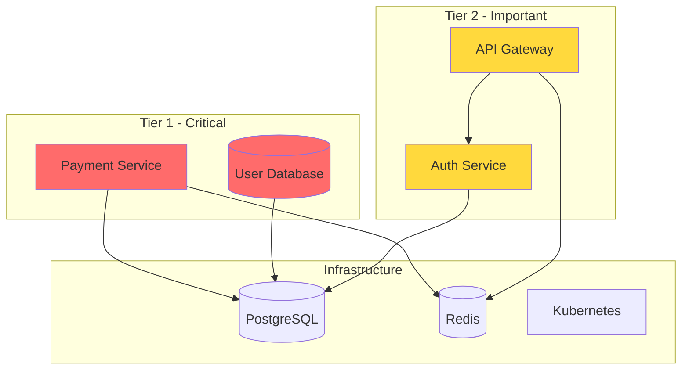

# 19 - Disaster Recovery Workflow

Comprehensive approach to planning, implementing, and testing disaster recovery procedures to ensure business continuity.

---

## Overview

This workflow establishes disaster recovery capabilities including backup strategies, failover procedures, and recovery testing.

## When to Use

- Setting up DR for new systems
- Annual DR planning review
- DR drill execution
- Post-incident DR improvements
- Compliance requirements
- Business continuity planning

---

## Quick Start

```bash
./blackbox.sh start "dr-[system]-[scenario]"
```

---

## Cascade Prompt

```
Execute Disaster Recovery workflow for: [SYSTEM/SERVICE]

DR tier: [Tier 1 - Critical / Tier 2 - Important / Tier 3 - Standard]
RTO target: [Recovery Time Objective]
RPO target: [Recovery Point Objective]
Current state: [none/basic/tested]

Steps:
1. Classify systems by criticality
2. Define RTO/RPO targets
3. Design backup strategy
4. Implement failover procedures
5. Document runbooks
6. Test and validate

Reference: workflows/tier-2/19-disaster-recovery.md
Session: [CURRENT-SESSION-ID]
```

---

## Recovery Objectives

```
┌─────────────────────────────────────────────────────────────────┐
│                    RECOVERY OBJECTIVES                          │
├─────────────────────────────────────────────────────────────────┤
│                                                                 │
│  RPO (Recovery Point Objective)                                 │
│  ─────────────────────────────                                  │
│  Maximum acceptable data loss measured in time                  │
│                                                                 │
│  ◀────────────────────── Time ──────────────────────▶          │
│  │                                                   │          │
│  Last Backup ─────────────────────────────▶ Disaster           │
│       │                                         │               │
│       └──────────── RPO (Data Loss) ───────────┘               │
│                                                                 │
│  RTO (Recovery Time Objective)                                  │
│  ─────────────────────────────                                  │
│  Maximum acceptable downtime                                    │
│                                                                 │
│  ◀────────────────────── Time ──────────────────────▶          │
│  │                                                   │          │
│  Disaster ────────────────────────────────▶ Recovery           │
│       │                                         │               │
│       └──────────── RTO (Downtime) ────────────┘               │
│                                                                 │
└─────────────────────────────────────────────────────────────────┘
```

### Tier Classification

| Tier | RPO | RTO | Examples |
|------|-----|-----|----------|
| **Tier 1** - Critical | < 1 hour | < 1 hour | Payment processing, Auth |
| **Tier 2** - Important | < 4 hours | < 4 hours | Core API, Database |
| **Tier 3** - Standard | < 24 hours | < 24 hours | Reporting, Analytics |
| **Tier 4** - Low | < 72 hours | < 72 hours | Dev/Test environments |

---

## Phase 1: System Classification

### Criticality Assessment Template

```yaml
# dr-classification.yaml
systems:
  - name: payment-service
    tier: 1
    description: "Processes all payment transactions"
    dependencies:
      - postgres-primary
      - redis-cluster
      - stripe-api
    rpo: 0  # Zero data loss
    rto: 15m
    mtpd: 1h  # Maximum Tolerable Period of Disruption
    owner: "@payments-team"
    
  - name: user-database
    tier: 1
    description: "Primary user data store"
    dependencies:
      - postgres-primary
    rpo: 5m
    rto: 30m
    mtpd: 2h
    owner: "@platform-team"
    
  - name: api-gateway
    tier: 2
    description: "API routing and rate limiting"
    dependencies:
      - redis-cluster
      - config-service
    rpo: 1h
    rto: 1h
    mtpd: 4h
    owner: "@platform-team"
    
  - name: analytics-pipeline
    tier: 3
    description: "Data analytics processing"
    dependencies:
      - kafka-cluster
      - clickhouse
    rpo: 24h
    rto: 8h
    mtpd: 48h
    owner: "@data-team"
```

### Dependency Mapping



---

## Phase 2: Backup Strategy

### Backup Configuration

```yaml
# backup-strategy.yaml
databases:
  postgres-primary:
    type: postgresql
    backup_methods:
      - method: continuous_wal
        description: "Point-in-time recovery"
        retention: 7d
        destination: s3://backups/wal/
        
      - method: daily_snapshot
        description: "Full daily backup"
        schedule: "0 2 * * *"
        retention: 30d
        destination: s3://backups/daily/
        
      - method: weekly_snapshot
        description: "Full weekly backup"
        schedule: "0 3 * * 0"
        retention: 90d
        destination: s3://backups/weekly/
        
    replication:
      type: streaming
      replicas:
        - region: us-west-2
          type: sync
        - region: eu-west-1
          type: async

  redis-cluster:
    type: redis
    backup_methods:
      - method: rdb_snapshot
        schedule: "*/15 * * * *"
        retention: 24h
        
      - method: aof_backup
        schedule: "0 * * * *"
        retention: 7d

applications:
  config-files:
    sources:
      - /etc/app/config/
      - /etc/nginx/
    schedule: "0 * * * *"
    retention: 30d
    destination: s3://backups/config/
```

### Backup Automation Script

```bash
#!/bin/bash
# backup.sh

set -e

TIMESTAMP=$(date +%Y%m%d_%H%M%S)
BACKUP_BUCKET="s3://company-backups"

log() {
    echo "[$(date '+%Y-%m-%d %H:%M:%S')] $1"
}

backup_postgres() {
    local DB_NAME=$1
    local BACKUP_FILE="${DB_NAME}_${TIMESTAMP}.sql.gz"
    
    log "Starting PostgreSQL backup: $DB_NAME"
    
    pg_dump -Fc $DB_NAME | gzip > "/tmp/$BACKUP_FILE"
    
    aws s3 cp "/tmp/$BACKUP_FILE" "${BACKUP_BUCKET}/postgres/${BACKUP_FILE}"
    
    rm "/tmp/$BACKUP_FILE"
    
    log "PostgreSQL backup complete: $BACKUP_FILE"
}

backup_redis() {
    local REDIS_HOST=$1
    local BACKUP_FILE="redis_${TIMESTAMP}.rdb"
    
    log "Starting Redis backup"
    
    redis-cli -h $REDIS_HOST BGSAVE
    sleep 10
    
    aws s3 cp "/var/lib/redis/dump.rdb" "${BACKUP_BUCKET}/redis/${BACKUP_FILE}"
    
    log "Redis backup complete: $BACKUP_FILE"
}

verify_backup() {
    local BACKUP_PATH=$1
    
    log "Verifying backup: $BACKUP_PATH"
    
    if aws s3 ls "$BACKUP_PATH" > /dev/null 2>&1; then
        log "✅ Backup verified"
        return 0
    else
        log "❌ Backup verification failed"
        return 1
    fi
}

cleanup_old_backups() {
    local PREFIX=$1
    local RETENTION_DAYS=$2
    
    log "Cleaning up backups older than $RETENTION_DAYS days"
    
    aws s3 ls "${BACKUP_BUCKET}/${PREFIX}/" | while read -r line; do
        file_date=$(echo $line | awk '{print $1}')
        file_name=$(echo $line | awk '{print $4}')
        
        if [[ $(date -d "$file_date" +%s) -lt $(date -d "-${RETENTION_DAYS} days" +%s) ]]; then
            aws s3 rm "${BACKUP_BUCKET}/${PREFIX}/${file_name}"
            log "Deleted: $file_name"
        fi
    done
}

# Main execution
log "=== Starting Backup Process ==="

backup_postgres "production_db"
backup_redis "redis-primary.internal"

cleanup_old_backups "postgres" 30
cleanup_old_backups "redis" 7

log "=== Backup Process Complete ==="
```

---

## Phase 3: Failover Procedures

### Database Failover Runbook

```markdown
## Runbook: PostgreSQL Primary Failover

### Prerequisites
- [ ] Confirm primary is truly unavailable
- [ ] Notify stakeholders
- [ ] Start incident timer

### Automated Failover (Patroni)
1. Patroni should automatically promote replica
2. Verify new primary:
   ```bash
   patronictl list
   ```
3. Confirm application connections switched

### Manual Failover
1. **Stop writes to primary**
   ```bash
   # On primary (if accessible)
   psql -c "SELECT pg_switch_wal();"
   ```

2. **Promote replica**
   ```bash
   # On replica
   pg_ctl promote -D /var/lib/postgresql/data
   ```

3. **Update DNS/load balancer**
   ```bash
   aws route53 change-resource-record-sets \
     --hosted-zone-id $ZONE_ID \
     --change-batch file://dns-failover.json
   ```

4. **Verify new primary**
   ```bash
   psql -h new-primary -c "SELECT pg_is_in_recovery();"
   # Should return 'f' (false)
   ```

5. **Test application connectivity**
   ```bash
   curl -s https://api.example.com/health | jq .database
   ```

### Post-Failover
- [ ] Update monitoring
- [ ] Rebuild failed node as replica
- [ ] Document in incident timeline
- [ ] Schedule post-mortem
```

### Multi-Region Failover

```yaml
# multi-region-failover.yaml
regions:
  primary: us-east-1
  secondary: us-west-2
  tertiary: eu-west-1

failover_triggers:
  - condition: "health_check_failures > 3"
    action: automatic_failover
    
  - condition: "region_unavailable"
    action: automatic_failover
    
  - condition: "manual_trigger"
    action: controlled_failover

failover_procedure:
  1_traffic_redirect:
    description: "Route traffic to secondary region"
    steps:
      - update_route53_health_check: disable_primary
      - wait_for_dns_propagation: 60s
      
  2_database_promotion:
    description: "Promote secondary database"
    steps:
      - verify_replication_lag: < 1s
      - promote_replica: secondary
      - update_connection_strings: true
      
  3_cache_warmup:
    description: "Warm caches in secondary region"
    steps:
      - invalidate_caches: all
      - preload_critical_data: true
      
  4_verification:
    description: "Verify failover success"
    steps:
      - health_checks: all_services
      - smoke_tests: critical_paths
      - monitoring_alerts: clear
```

---

## Phase 4: Recovery Procedures

### Full Recovery Runbook

```markdown
## Runbook: Full System Recovery

### Scenario: Complete data center loss

### Phase 1: Assessment (15 min)
1. Confirm scope of disaster
2. Activate DR team
3. Notify stakeholders
4. Start recovery timer

### Phase 2: Infrastructure (30 min)
1. **Activate DR environment**
   ```bash
   terraform apply -var="environment=dr"
   ```

2. **Verify network connectivity**
   ```bash
   ./scripts/verify-network.sh
   ```

3. **Start core services**
   ```bash
   kubectl apply -f k8s/core/
   ```

### Phase 3: Data Recovery (60 min)
1. **Restore database from backup**
   ```bash
   # Get latest backup
   LATEST=$(aws s3 ls s3://backups/postgres/ | tail -1 | awk '{print $4}')
   
   # Download and restore
   aws s3 cp s3://backups/postgres/$LATEST /tmp/
   pg_restore -d production /tmp/$LATEST
   ```

2. **Apply WAL logs for point-in-time recovery**
   ```bash
   # If continuous archiving was enabled
   pg_ctl start -D /var/lib/postgresql/data \
     -o "-c recovery_target_time='2024-12-17 10:00:00'"
   ```

3. **Restore Redis cache**
   ```bash
   # Cache will rebuild from DB, or restore RDB
   redis-cli FLUSHALL
   ./scripts/warm-cache.sh
   ```

### Phase 4: Application Recovery (30 min)
1. **Deploy applications**
   ```bash
   kubectl apply -f k8s/applications/
   ```

2. **Verify health**
   ```bash
   kubectl get pods -A
   ./scripts/health-check.sh
   ```

3. **Run smoke tests**
   ```bash
   npm run test:smoke
   ```

### Phase 5: Traffic Restoration (15 min)
1. **Update DNS**
   ```bash
   aws route53 change-resource-record-sets \
     --hosted-zone-id $ZONE_ID \
     --change-batch file://dr-dns.json
   ```

2. **Enable load balancer**
   ```bash
   aws elbv2 modify-listener --listener-arn $LB_ARN \
     --default-actions Type=forward,TargetGroupArn=$DR_TG_ARN
   ```

3. **Monitor traffic**
   - Check request rates
   - Verify error rates < 1%
   - Confirm user sessions

### Phase 6: Validation
- [ ] All critical services operational
- [ ] Data integrity verified
- [ ] Performance metrics normal
- [ ] Security controls active
- [ ] Monitoring and alerting functional

### Recovery Complete Checklist
- [ ] Document actual RTO achieved
- [ ] Document actual RPO achieved
- [ ] Capture lessons learned
- [ ] Schedule post-mortem
- [ ] Plan failback procedure
```

---

## Phase 5: DR Testing

### DR Drill Plan

```markdown
## DR Drill Plan: Q4 2024

### Drill Type: Full Failover Test
### Date: 2024-12-20 02:00 UTC (Maintenance Window)
### Duration: 4 hours
### Participants: Platform, Database, SRE teams

### Objectives
1. Validate RTO of < 1 hour for Tier 1 systems
2. Verify data integrity after recovery
3. Test automated failover procedures
4. Identify gaps in runbooks

### Pre-Drill Checklist
- [ ] Stakeholders notified (1 week before)
- [ ] Maintenance window approved
- [ ] DR environment verified
- [ ] Backups current
- [ ] Runbooks reviewed
- [ ] Communication channels tested

### Drill Scenario
1. **00:00** - Simulate primary region failure
2. **00:05** - Automated detection triggers
3. **00:10** - DR team assembles
4. **00:15** - Begin failover procedure
5. **00:45** - Services restored in DR region
6. **01:00** - Smoke tests complete
7. **01:30** - Failback procedure
8. **02:30** - Primary region restored
9. **03:00** - Drill complete

### Success Criteria
| Metric | Target | Actual |
|--------|--------|--------|
| Detection time | < 5 min | |
| Failover time | < 45 min | |
| Data loss | < 5 min RPO | |
| Service availability | 99% | |

### Post-Drill
- [ ] Metrics documented
- [ ] Issues logged
- [ ] Runbooks updated
- [ ] Report distributed
- [ ] Next drill scheduled
```

### Automated DR Testing

```bash
#!/bin/bash
# dr-test.sh

set -e

log() {
    echo "[$(date '+%Y-%m-%d %H:%M:%S')] $1" | tee -a dr-test.log
}

test_backup_restoration() {
    log "Testing backup restoration..."
    
    # Create test database
    createdb dr_test_db
    
    # Get latest backup
    LATEST_BACKUP=$(aws s3 ls s3://backups/postgres/ | tail -1 | awk '{print $4}')
    
    # Restore to test database
    aws s3 cp "s3://backups/postgres/$LATEST_BACKUP" /tmp/
    pg_restore -d dr_test_db "/tmp/$LATEST_BACKUP"
    
    # Verify row counts match production
    PROD_COUNT=$(psql -t production -c "SELECT count(*) FROM users")
    TEST_COUNT=$(psql -t dr_test_db -c "SELECT count(*) FROM users")
    
    if [ "$PROD_COUNT" == "$TEST_COUNT" ]; then
        log "✅ Backup restoration verified: $TEST_COUNT rows"
    else
        log "❌ Row count mismatch: prod=$PROD_COUNT, test=$TEST_COUNT"
        exit 1
    fi
    
    # Cleanup
    dropdb dr_test_db
}

test_failover_dns() {
    log "Testing DNS failover..."
    
    # Simulate health check failure
    aws route53-recovery-control update-routing-control-state \
        --routing-control-arn $PRIMARY_CONTROL_ARN \
        --routing-control-state Off
    
    sleep 60
    
    # Verify DNS points to secondary
    RESOLVED_IP=$(dig +short api.example.com)
    EXPECTED_IP=$(aws ec2 describe-instances --filters "Name=tag:Role,Values=dr" \
        --query 'Reservations[0].Instances[0].PublicIpAddress' --output text)
    
    if [ "$RESOLVED_IP" == "$EXPECTED_IP" ]; then
        log "✅ DNS failover successful"
    else
        log "❌ DNS failover failed"
    fi
    
    # Restore primary
    aws route53-recovery-control update-routing-control-state \
        --routing-control-arn $PRIMARY_CONTROL_ARN \
        --routing-control-state On
}

# Run tests
log "=== Starting DR Tests ==="
test_backup_restoration
test_failover_dns
log "=== DR Tests Complete ==="
```

---

## DR Documentation

### DR Plan Template

```markdown
## Disaster Recovery Plan

### Document Control
| Version | Date | Author | Changes |
|---------|------|--------|---------|
| 1.0 | 2024-12-17 | DR Team | Initial |

### 1. Purpose
This plan outlines procedures for recovering critical systems
in the event of a disaster affecting our primary data center.

### 2. Scope
- Production systems in us-east-1
- All Tier 1 and Tier 2 services
- Customer-facing applications

### 3. Recovery Objectives
| System | RPO | RTO | Tier |
|--------|-----|-----|------|
| Payment Service | 0 | 15m | 1 |
| User Database | 5m | 30m | 1 |
| API Gateway | 1h | 1h | 2 |

### 4. DR Team
| Role | Primary | Backup | Contact |
|------|---------|--------|---------|
| DR Lead | Jane Doe | John Smith | +1-xxx |
| Database | ... | ... | ... |
| Infrastructure | ... | ... | ... |

### 5. Communication
- War room: #incident-war-room
- Status page: status.example.com
- Customer comms: support@example.com

### 6. Procedures
See runbooks in /docs/runbooks/dr/

### 7. Testing Schedule
- Monthly: Backup restoration tests
- Quarterly: Partial failover drills
- Annually: Full DR exercise

### 8. Appendices
- A: Contact list
- B: Vendor contacts
- C: Recovery checklists
```

---

## Black Box Integration

```bash
# Start DR session
./blackbox.sh start "dr-quarterly-drill"

# Log drill execution
./blackbox.sh action "Initiated failover simulation" "Primary disabled"
./blackbox.sh checkpoint "Before database promotion"
./blackbox.sh action "Promoted DR database" "15 seconds data loss"
./blackbox.sh action "Restored services" "32 minutes total"
./blackbox.sh issue "Runbook step 5 unclear" "Updated documentation"
./blackbox.sh milestone "DR drill completed successfully"

# Log results
./blackbox.sh decision "Update failover automation" "Reduce RTO by 10 min"

# End session
./blackbox.sh end "RTO: 32min, RPO: 15sec - Within targets"
```

---

*Disaster Recovery Workflow v1.0*
*Integrates with Black Box for tracking*
